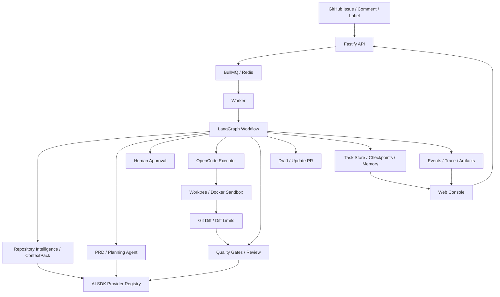

<div align="center">

<p align="center">
  <strong><font size="6">CodeZero</font></strong>
</p>

**Write an Issue → Get a verified PR.**

[](https://www.typescriptlang.org/)
[](https://langchain-ai.github.io/langgraph/)
[](https://sdk.vercel.ai/)
[](https://github.com/opencode-ai/opencode)

**English** · [中文](README.md)

</div>

## Showcase

<table>
  <tr>
    <th>Issue to Plan</th>
    <th>Plan to PR</th>
  </tr>
  <tr>
    <td></td>
    <td></td>
  </tr>
</table>

## Core Flow

1. **Trigger**: GitHub webhooks, issue comments, labels, or manual dashboard actions create a task.
2. **Queue**: The API stores the task and sends it to BullMQ/Redis.
3. **Prepare context**: The worker creates or reuses a worktree/Docker sandbox, then loads project rules, CodeGraph, Navigation Graph, Memory, and ContextPack.
4. **Plan**: The PRD agent produces acceptance criteria, risks, touched areas, and verification commands.
5. **Approve**: LangGraph pauses on required human review and resumes the same task thread after approval.
6. **Implement**: OpenCode edits the repository in the persistent sandbox while output is streamed into events and traces.
7. **Verify and repair**: Quality gates, screenshot checks, and the review agent can send feedback into a repair loop.
8. **Ship PR**: CodeZero pushes the branch and creates or updates a draft PR with evidence and local reproduction commands.

## Key Features

| Feature                 | Description                                                                                      |
| :---------------------- | :----------------------------------------------------------------------------------------------- |
| Issue to PR             | Turns GitHub Issues into plans, diffs, verification results, and draft PRs                       |
| LangGraph orchestration | Checkpoints, human interrupts, resumed runs, and PR feedback iterations                          |
| Worker queue            | The API enqueues work while BullMQ/Redis and the worker run long tasks                           |
| AI SDK model layer      | Unified OpenAI-compatible and native providers with structured output and retries                |
| OpenCode executor       | CLI-first code editing with CodeZero-owned context and validation boundaries                     |
| Repository intelligence | CodeGraph, Navigation Graph, ContextPack, project rules, and Memory in one task context          |
| Persistent sandbox      | One worktree or Docker sandbox reused across approval, repair, and feedback cycles               |
| Verification evidence   | Build, lint, typecheck, test, screenshot, and review results in events, artifacts, and PR bodies |
| Operator console        | Run Console, Settings Console, Memory Inbox, Trace Replay, GitHub sync, and knowledge graphs     |

## Architecture



## Monorepo Layout

```text
apps/
  api/       Fastify API, GitHub webhooks, GitHub sync, settings, tasks, knowledge graph routes
  web/       Next.js console for tasks, settings, Memory, repo sync, and knowledge graphs
  worker/    BullMQ worker that runs the LangGraph issue workflow

packages/
  codebase-intelligence/  CodeGraph, symbol indexing, navigation graph, ContextPack, repository onboarding
  config/                 YAML and environment config loading, validation, Settings Console editing model
  evals/                  Golden issue evaluation CLI
  github/                 GitHub Issues, comments, branches, PRs, App/PAT auth
  memory/                 Memory records, approval state, capacity limits, corrupt-file quarantine
  model-runtime/          AI SDK provider registry, model routing, structured agent runner
  observability/          Task traces, event shaping, replay data
  orchestrator/           Task state machine, branch naming, repository concurrency decisions
  persistence/            File and Postgres task repositories
  project-context/        `.agent` project documents, rules, and business skill loading
  sandbox/                Worktree/Docker sandboxes and command execution
  shared/                 Shared types and utilities
  skills/                 Platform skill loader
  verification/           Quality gates, screenshots, and local verification helpers
  workflow-graph/         LangGraph graph, checkpoints, resumes, and interrupts
  workflows/              Issue-to-PR phases, with core logic split under `src/phases/`

docs/
  README.md               Documentation index
  ARCHITECTURE.md         Runtime architecture and boundaries
  CORE_TECH.md            Core technology notes
  archive/                Historical refactor plans and archived docs
```

## Quick Start

### Prerequisites

- Node.js >= 20
- pnpm >= 10
- Docker for Postgres, Redis, and local sandboxes
- OpenCode CLI on `PATH`, or `OPENCODE_BIN` pointing to a local binary

### Install

```bash
git clone https://github.com/JASON-QWeb/CodeZero.git
cd CodeZero
pnpm install
cp .env.example .env
```

### Configure

Edit `.env` with at least a model provider and GitHub credentials:

```bash
OPENAI_BASE_URL=https://api.openai.com/v1
OPENAI_API_KEY=sk-...
OPENAI_MODEL=gpt-4.1

GITHUB_APP_ID=123456
GITHUB_APP_INSTALLATION_ID=789012
GITHUB_APP_PRIVATE_KEY_PATH=./secrets/codezero-app.pem
GITHUB_WEBHOOK_SECRET=your-webhook-secret
AGENT_TRIGGER_MENTION=@codezero
```

`GITHUB_TOKEN` can be used as a fallback. Complete `GITHUB_APP_*` credentials take precedence through a GitHub App installation token.

Common environment variables:

| Variable                                                | Purpose                                                    |
| :------------------------------------------------------ | :--------------------------------------------------------- |
| `OPENAI_BASE_URL`, `OPENAI_API_KEY`, `OPENAI_MODEL`     | Default OpenAI-compatible provider                         |
| `GITHUB_APP_*`, `GITHUB_TOKEN`, `GITHUB_WEBHOOK_SECRET` | GitHub App/PAT and webhook auth                            |
| `REDIS_URL`                                             | BullMQ connection, defaults to `redis://localhost:6379`    |
| `STORAGE_DRIVER`, `TASK_STORE_FILE`, `DATABASE_URL`     | Task storage, supporting file and Postgres                 |
| `MEMORY_STORE_FILE`                                     | Memory file store                                          |
| `NEXT_PUBLIC_API_URL`                                   | API URL used by the web console                            |
| `CODEZERO_API_TOKEN`, `NEXT_PUBLIC_API_TOKEN`           | Optional API access token, shared by server and web client |
| `UNDERSTAND_ANYTHING_*`                                 | Official Understand-Anything knowledge graph integration   |

Runtime configuration lives in `config/`:

| File                           | Purpose                                                                       |
| :----------------------------- | :---------------------------------------------------------------------------- |
| `config/codezero.yaml`         | Defaults for providers, agents, repositories, sandbox, memory, workflow graph |
| `config/codezero.example.yaml` | Reference template for new installations                                      |

### Run

```bash
docker compose -f infra/docker/docker-compose.yml up -d

pnpm dev:api
pnpm dev:worker
pnpm dev:web
```

You can also run `pnpm dev` to start all workspace dev tasks. The Web Console defaults to [http://localhost:3000](http://localhost:3000), and the API defaults to [http://localhost:4000](http://localhost:4000).

## Common Commands

```bash
pnpm check          # lint + typecheck + coverage + build
pnpm eval:golden    # score golden issues against candidate artifacts
pnpm onboard:repo   # run the repository onboarding CLI
```

Evaluation reports are written to `artifacts/eval-report.md` by default.

## Knowledge Graphs

CodeZero includes lightweight repository intelligence and an integration point for the official Understand-Anything project. After installing the official Codex skill, the console can generate repository knowledge graphs and open the dashboard:

```bash
curl -fsSL https://raw.githubusercontent.com/Lum1104/Understand-Anything/main/install.sh | bash -s codex
```

## Documentation

- [Documentation index](docs/README.md)
- [Architecture](docs/ARCHITECTURE.md)
- [Core technology](docs/CORE_TECH.md)
- [Archive](docs/archive/README.md)

## License

CodeZero is licensed under the [MIT License](LICENSE).
