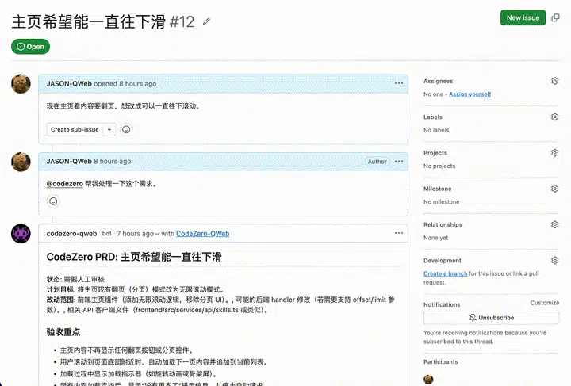
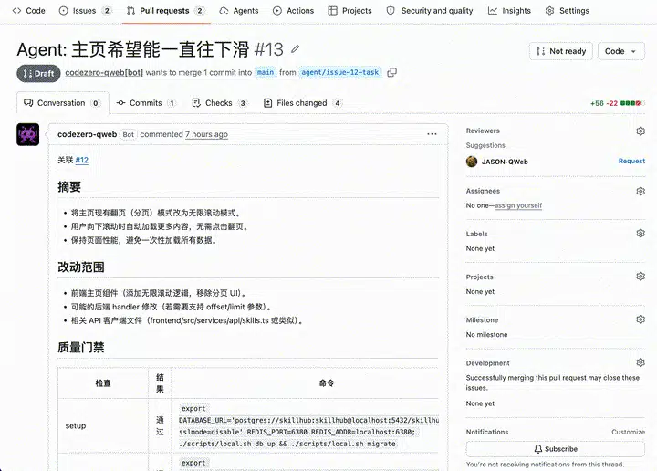
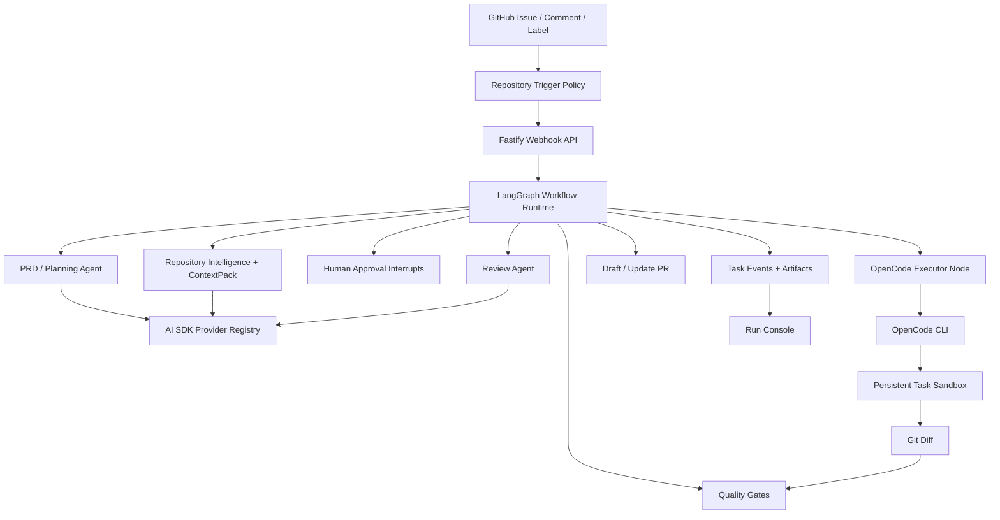

<div align="center">

<br />

<picture>
  <source media="(prefers-color-scheme: dark)" srcset="https://img.shields.io/badge/CodeZero-000000?style=for-the-badge&logo=github&logoColor=white&labelColor=000000">
</picture>

# CodeZero

### Automated workflow from requirements to code delivery, no manual coding required

**Write an Issue → Get a verified PR.**

[](LICENSE)
[](https://www.typescriptlang.org/)
[](https://langchain-ai.github.io/langgraph/)
[](https://sdk.vercel.ai/)

**English** · [中文](README.md)

---

</div>

<br />

## Showcase

<div align="center">

<table>
<tr>
<td width="50%" align="center">

### Issue to Plan



</td>
<td width="50%" align="center">

### Plan to PR



</td>
</tr>
</table>

</div>

---

## Why CodeZero?

CodeZero handles the **entire engineering workflow** — from product intent to a verified, reviewable pull request.

<table>
<tr>
<td align="center" width="33%">
<h3>Plan</h3>
<p>Converts Issues into structured PRD/Plan documents with acceptance criteria, risks, file analysis, tests, and commands.</p>
</td>
<td align="center" width="33%">
<h3>Build</h3>
<p>An AI coding agent implements changes in a persistent sandbox with live stdout/stderr streaming to the Run Console.</p>
</td>
<td align="center" width="33%">
<h3>Ship</h3>
<p>Runs build, lint, test, typecheck, and review gates — then opens a draft PR with verification evidence and local repro steps.</p>
</td>
</tr>
</table>

---

## Key Features

| Feature | Description |
|:---|:---|
| **Issue → PRD → PR** | Transforms GitHub Issues into structured planning documents, verified diffs, and draft PRs |
| **LangGraph Orchestration** | Durable checkpoints with approval interrupts, process restart recovery, and resumable repair loops |
| **AI SDK Model Layer** | Unified provider registry for PRD, review, context, validation, and routing agents with transient failure retries |
| **Live Agent Progress** | Real-time streaming of coding agent output as board events |
| **Repository Intelligence** | CodeGraph + Navigation Graph + ContextPack narrow the edit surface before changes begin |
| **Persistent Task Sandbox** | One worktree or Docker sandbox per Issue, reused across approval cycles, feedback iterations, and reruns |
| **Human-in-the-Loop** | PRD approval, policy gates, review subagents, and memory proposals keep humans in control |
| **Multi-Provider Support** | OpenAI, Anthropic, Gemini, xAI, Mistral, Groq — route different agents to different models |
| **Operator Console** | Run Console, Settings Console, Memory Inbox, Trace Replay API, Golden Issue Eval CLI |

---

## Runtime Guarantees

| Area | Current implementation |
|:---|:---|
| Docker isolation | Docker mode executes commands through `docker run`, mounts repo/artifacts/logs, defaults to `--network none`, and applies `--cap-drop ALL`, `no-new-privileges`, memory, CPU, and PID limits; with a network allowlist it uses bridge networking plus command-level host validation |
| Worktree sandbox | Worktree mode uses a mirrored repository cache and `git worktree add --force -B` to create a real issue-branch workspace |
| Diff limits | After implementation, `max_diff_files` and `max_diff_lines` block oversized diffs before PR creation |
| LangGraph checkpoints | File storage writes to `data/langgraph-checkpoints.json` by default; Postgres storage writes to `langgraph_checkpoints` and `langgraph_checkpoint_writes` |
| Trace Replay API | `GET /tasks/:id/trace/replay?cursor=&limit=` returns replay steps, failed step, pagination cursor, and available resume actions |
| Memory system | `GET/PATCH/DELETE /memories/:id` and `POST /memories/prune` support editing, deletion, pruning, capacity limits, and corrupt-file quarantine |
| Stability | Postgres DDL runs once per repository instance; corrupt JSON files are quarantined as `.corrupt-*`; model calls retry transient timeouts, rate limits, and network failures |
| Agent capability | PRD, search planning, implementation, and review agents are configured by default; the review agent receives PR compliance, frontend screenshot verification, and backend test verification skills |

---

## How It Works

```
  ┌─────────────┐     ┌──────────────┐     ┌──────────────┐     ┌─────────────┐
  │   Trigger    │────▶│   Analyze    │────▶│    Plan      │────▶│   Approve   │
  │  (Issue /    │     │  (Index repo,│     │  (Generate   │     │  (Human     │
  │   @mention)  │     │   context)   │     │   PRD/Plan)  │     │   review)   │
  └─────────────┘     └──────────────┘     └──────────────┘     └──────┬──────┘
                                                                       │
  ┌─────────────┐     ┌──────────────┐     ┌──────────────┐     ┌──────▼──────┐
  │   Ship PR   │◀────│   Verify     │◀────│   Stream     │◀────│  Implement  │
  │  (Draft PR  │     │  (Build/Test/│     │  (Live board │     │  (OpenCode  │
  │   + evidence│     │   Review)    │     │   events)    │     │   sandbox)  │
  └─────────────┘     └──────────────┘     └──────────────┘     └─────────────┘
```

1. **Trigger** — GitHub webhook, `@agent` mention, label, or manual import creates a task
2. **Workspace** — Creates or reuses the persistent task sandbox and issue branch
3. **Analyze** — Repository indexing, navigation graph, approved memory, and ContextPack identify relevant files
4. **Plan** — One planning pass produces the PRD/Plan document for approval and implementation
5. **Approve** — LangGraph interrupts when human approval is needed, then resumes the same thread
6. **Implement** — OpenCode edits the sandboxed repository using the generated prompt and model config
7. **Stream** — Executor output becomes real-time board events: progress, files, commands, errors
8. **Verify** — Build, lint, test, typecheck, screenshots, policy checks, and review subagents run
9. **Ship** — Pushes branch and opens a draft PR with evidence, risks, and local verification commands

---

## Architecture



---

## Monorepo Layout

```text
apps/
  api/       Fastify API, GitHub webhooks, settings routes, task routes
  web/       Next.js Run Console, Settings Console, Memory Inbox
  worker/    Queue worker and repository task execution
packages/
  codebase-intelligence/  Indexing, hybrid search, ContextPack, repo graph
  config/                 YAML config loading and validation
  github/                 GitHub Issue, branch, comment, PR integration
  memory/                 Approved memory and memory proposal store
  model-runtime/          AI SDK model registry and structured agent runner
  observability/          Task traces and replay-friendly event shaping
  orchestrator/           Task state machine and workflow decisions
  persistence/            File/Postgres task persistence
  sandbox/                Docker/worktree sandbox abstraction
  skills/                 Platform skill loader and built-in skills
  verification/           Test, screenshot, and local verification helpers
  workflow-graph/         LangGraph task graph, checkpoints, callbacks
  workflows/              Issue-to-PR workflow composition
```

---

## Quick Start

### Prerequisites

- Node.js ≥ 20
- [pnpm](https://pnpm.io/) ≥ 10
- Docker (for local sandbox)
- [OpenCode CLI](https://github.com/opencode-ai/opencode) on `PATH`

### Installation

```bash
# Clone the repository
git clone https://github.com/JASON-QWeb/CodeZero.git
cd CodeZero

# Install dependencies
pnpm install

# Configure environment
cp .env.example .env
```

### Configuration

Edit `.env` with your provider and GitHub credentials:

```bash
OPENAI_BASE_URL=https://api.openai.com/v1
OPENAI_API_KEY=sk-...
OPENAI_MODEL=gpt-4o
# Prefer GitHub App credentials for CodeZero[bot]-style comments and PRs.
GITHUB_APP_ID=123456
GITHUB_APP_INSTALLATION_ID=789012
GITHUB_APP_PRIVATE_KEY_PATH=./secrets/codezero-app.pem
# Optional fallback PAT when GitHub App credentials are not configured.
GITHUB_TOKEN=ghp_...
GITHUB_WEBHOOK_SECRET=your-webhook-secret
AGENT_TRIGGER_MENTION=@codezero
```

When both `GITHUB_APP_*` and `GITHUB_TOKEN` are configured, CodeZero uses the GitHub App installation token first. Use `GITHUB_APP_PRIVATE_KEY_PATH` for local runs; `GITHUB_APP_PRIVATE_KEY` also works when newlines are escaped as `\n`.

> **Tip:** You can switch providers and save API keys later from the **Settings Console** UI.

### Launch

```bash
# Start infrastructure
docker compose -f infra/docker/docker-compose.yml up -d

# Start services (in separate terminals or use `pnpm dev` for all)
pnpm dev:api      # API server
pnpm dev:worker   # Task worker
pnpm dev:web      # Web console
```

Open the **Web Console** at [`http://localhost:3000`](http://localhost:3000)

---

## OpenCode Executor

CodeZero's implementation path is **CLI-first**. The default sandbox executor runs OpenCode with a generated prompt file:

```bash
OPENCODE_BIN="${OPENCODE_BIN:-opencode}"
"$OPENCODE_BIN" run \
  --agent build \
  --model "$CODEZERO_OPENCODE_MODEL" \
  --variant "${CODEZERO_OPENCODE_VARIANT:-minimal}" \
  --format json \
  --dangerously-skip-permissions \
  "Implement the CodeZero request in the attached prompt file." \
  --file="$CODEZERO_PROMPT_FILE"
```

<details>
<summary><strong>Provider Configuration Details</strong></summary>

- Install OpenCode on `PATH`, or set `OPENCODE_BIN` in `.env` to a local binary
- For **OpenAI-compatible gateways**, CodeZero writes a temporary `OPENCODE_CONFIG` that maps provider/model without exposing API keys in artifacts
- **Native AI SDK providers** (Anthropic, Gemini, xAI, Mistral, Groq) use OpenCode's native provider path by default
- Advanced executor overrides can be configured under `providers.<id>.coding_executor`

</details>

---

## Knowledge Graphs

CodeZero includes a lightweight repository intelligence pipeline. For richer, per-repository knowledge graphs, install the official [Understand-Anything](https://github.com/Lum1104/Understand-Anything) Codex skill:

```bash
curl -fsSL https://raw.githubusercontent.com/Lum1104/Understand-Anything/main/install.sh | bash -s codex
```

The Run Console invokes the official `$understand` multi-agent pipeline and renders its dashboard inline. Output remains the upstream `.understand-anything/knowledge-graph.json`.

---

## Validation

```bash
pnpm check          # Lint + Typecheck + Tests (with coverage) + Build
pnpm eval:golden    # Score golden issues against candidate artifacts
```

Eval reports are written to `artifacts/eval-report.md`.

---

## Configuration

Runtime configuration lives in `config/`:

| File | Purpose |
|:---|:---|
| `codezero.yaml` | Model providers, agent roles, repositories, sandbox, memory, workflow graph, policies, tool gateway |
| `codezero.example.yaml` | Clean template for new installations |

The **Settings Console** UI can edit and validate these files during local operation.

---

## License

CodeZero is licensed under the [MIT License](LICENSE).

---
