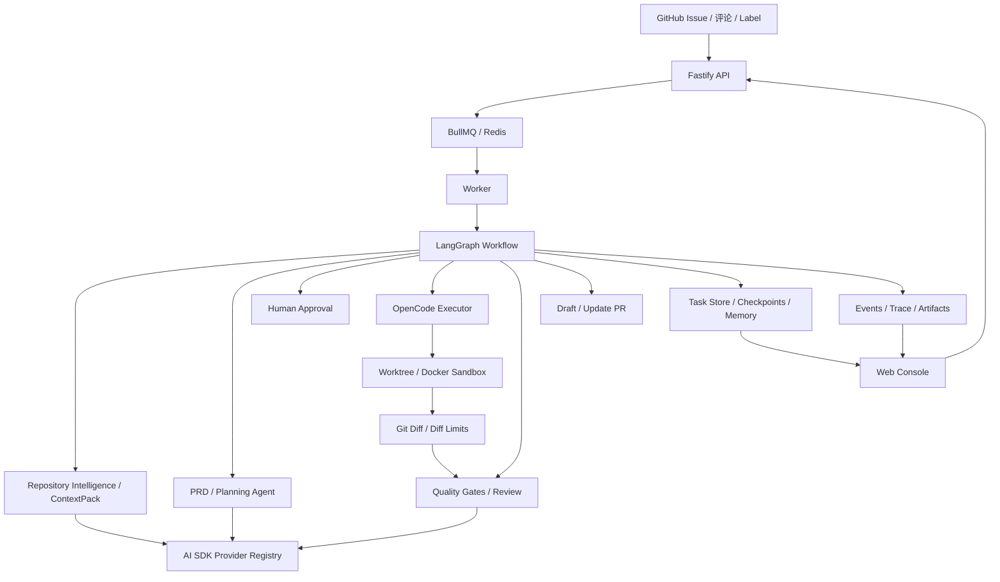

<div align="center">

<p align="center">
  <strong><font size="6">CodeZero</font></strong>
</p>

**写一个 Issue → 拿到一个验证过的 PR。**

[](https://www.typescriptlang.org/)
[](https://langchain-ai.github.io/langgraph/)
[](https://sdk.vercel.ai/)
[](https://github.com/opencode-ai/opencode)

[English](README.en.md) · **中文**

</div>

## 展示

<table>
  <tr>
    <th>Issue 到 Plan</th>
    <th>Plan 到 PR</th>
  </tr>
  <tr>
    <td></td>
    <td></td>
  </tr>
</table>

## 核心流程

1. **触发任务**：GitHub webhook、Issue 评论、Label 或控制台手动创建任务。
2. **进入队列**：API 创建 Task，并通过 BullMQ/Redis 投递到 worker。
3. **准备上下文**：worker 创建或复用 worktree/Docker 沙箱，加载项目规则、CodeGraph、Navigation Graph、Memory 和 ContextPack。
4. **生成计划**：PRD agent 生成 PRD/Plan，包含验收标准、风险、影响文件和验证命令。
5. **人工审批**：需要审批时 LangGraph 中断，同一个 task thread 在审批后继续运行。
6. **执行实现**：OpenCode 在持久沙箱内修改代码，并把输出流式写入事件和 trace。
7. **验证修复**：质量门、截图验证和 review agent 失败时，带反馈进入修复循环。
8. **发布 PR**：通过验证后推送分支，创建或更新 draft PR，并附带证据和本地复现命令。

## 核心特性

| 特性            | 说明                                                                                |
| :-------------- | :---------------------------------------------------------------------------------- |
| Issue 到 PR     | 从 GitHub Issue 生成计划、实现 diff、验证结果和 draft PR                            |
| LangGraph 编排  | checkpoint、人工中断、恢复运行、PR feedback 迭代                                    |
| Worker 队列     | API 只负责入队，BullMQ/Redis 和 worker 承担长任务执行                               |
| AI SDK 模型层   | 统一 OpenAI-compatible 和原生 provider，支持结构化输出和重试                        |
| OpenCode 执行层 | CLI-first 的代码修改路径，CodeZero 负责上下文和验证边界                             |
| 仓库智能理解    | CodeGraph、Navigation Graph、ContextPack、项目规则和 Memory 合并成任务上下文        |
| 持久沙箱        | 每个 Issue 复用同一个 worktree 或 Docker 沙箱，支持审批、修复和反馈迭代             |
| 质量证据        | build、lint、typecheck、test、截图和 review 结果写入事件、artifact 和 PR 正文       |
| 操作台          | Run Console、Settings Console、Memory Inbox、Trace Replay、GitHub sync 和知识图入口 |

## 架构



## Monorepo 结构

```text
apps/
  api/       Fastify API、GitHub webhook、GitHub sync、settings、tasks、knowledge graph routes
  web/       Next.js 控制台，包含任务看板、设置、Memory、仓库同步和知识图入口
  worker/    BullMQ worker，执行 LangGraph issue workflow

packages/
  codebase-intelligence/  CodeGraph、符号索引、导航图、ContextPack、仓库 onboarding
  config/                 YAML 和环境变量配置加载、校验、Settings Console 编辑模型
  evals/                  Golden issue 评估 CLI
  github/                 GitHub Issue、评论、分支、PR 和 App/PAT 鉴权
  memory/                 Memory 记录、审批状态、容量限制和损坏文件隔离
  model-runtime/          AI SDK provider registry、模型路由、结构化 agent runner
  observability/          Task trace、事件整理和 replay 数据
  orchestrator/           Task 状态机、分支命名、仓库并发决策
  persistence/            文件和 Postgres task repository
  project-context/        `.agent` 项目文档、规则和业务 skill 加载
  sandbox/                Worktree/Docker 沙箱和命令执行
  shared/                 共享类型和工具函数
  skills/                 平台 skill loader
  verification/           质量门、截图和本地验证辅助能力
  workflow-graph/         LangGraph graph、checkpoint、恢复和中断
  workflows/              Issue-to-PR 阶段实现，核心逻辑拆在 `src/phases/`

docs/
  README.md               文档入口
  ARCHITECTURE.md         运行架构和边界
  CORE_TECH.md            核心技术说明
  archive/                历史重构计划和已归档文档
```

## 快速开始

### 前置条件

- Node.js >= 20
- pnpm >= 10
- Docker，用于 Postgres、Redis 和本地沙箱
- OpenCode CLI 在 `PATH` 中，或通过 `OPENCODE_BIN` 指向本地二进制

### 安装

```bash
git clone https://github.com/JASON-QWeb/CodeZero.git
cd CodeZero
pnpm install
cp .env.example .env
```

### 配置

编辑 `.env`，至少填入模型 provider 和 GitHub 凭证：

```bash
OPENAI_BASE_URL=https://api.openai.com/v1
OPENAI_API_KEY=sk-...
OPENAI_MODEL=gpt-4.1

GITHUB_APP_ID=123456
GITHUB_APP_INSTALLATION_ID=789012
GITHUB_APP_PRIVATE_KEY_PATH=./secrets/codezero-app.pem
GITHUB_WEBHOOK_SECRET=your-webhook-secret
AGENT_TRIGGER_MENTION=@codezero
```

也可以用 `GITHUB_TOKEN` 作为 fallback。`GITHUB_APP_*` 配置完整时会优先使用 GitHub App installation token。

常用环境变量：

| 变量                                                    | 用途                                           |
| :------------------------------------------------------ | :--------------------------------------------- |
| `OPENAI_BASE_URL`、`OPENAI_API_KEY`、`OPENAI_MODEL`     | 默认 OpenAI-compatible provider                |
| `GITHUB_APP_*`、`GITHUB_TOKEN`、`GITHUB_WEBHOOK_SECRET` | GitHub App/PAT 和 webhook 鉴权                 |
| `REDIS_URL`                                             | BullMQ 队列连接，默认 `redis://localhost:6379` |
| `STORAGE_DRIVER`、`TASK_STORE_FILE`、`DATABASE_URL`     | Task 存储，支持 file 和 Postgres               |
| `MEMORY_STORE_FILE`                                     | Memory 文件存储                                |
| `NEXT_PUBLIC_API_URL`                                   | Web 控制台访问 API 的地址                      |
| `CODEZERO_API_TOKEN`、`NEXT_PUBLIC_API_TOKEN`           | 可选 API 访问令牌，前后端需要保持一致          |
| `UNDERSTAND_ANYTHING_*`                                 | 官方 Understand-Anything 知识图集成配置        |

运行配置位于 `config/`：

| 文件                           | 用途                                                                    |
| :----------------------------- | :---------------------------------------------------------------------- |
| `config/codezero.yaml`         | provider、agent、repositories、sandbox、memory、workflow graph 默认配置 |
| `config/codezero.example.yaml` | 新安装参考模板                                                          |

### 启动

```bash
docker compose -f infra/docker/docker-compose.yml up -d

pnpm dev:api
pnpm dev:worker
pnpm dev:web
```

也可以用 `pnpm dev` 一次启动所有 workspace dev 任务。Web 控制台默认地址是 [http://localhost:3000](http://localhost:3000)，API 默认地址是 [http://localhost:4000](http://localhost:4000)。

## 常用命令

```bash
pnpm check          # lint + typecheck + coverage + build
pnpm eval:golden    # 使用 golden issues 评估候选产物
pnpm onboard:repo   # 运行仓库 onboarding CLI
```

评估报告默认写入 `artifacts/eval-report.md`。

## 项目知识图

CodeZero 内置轻量仓库智能理解流程，并提供官方 Understand-Anything 集成入口。安装官方 Codex skill 后，可以在控制台触发仓库知识图生成和 dashboard 打开：

```bash
curl -fsSL https://raw.githubusercontent.com/Lum1104/Understand-Anything/main/install.sh | bash -s codex
```

## 文档

- [文档入口](docs/README.md)
- [架构说明](docs/ARCHITECTURE.md)
- [核心技术](docs/CORE_TECH.md)
- [历史归档](docs/archive/README.md)

## 开源协议

CodeZero 基于 [MIT License](LICENSE) 开源。
