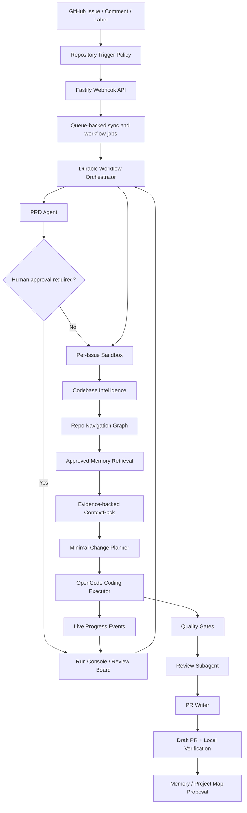

<div align="center">

# CodeZero

### GitHub Issues in, verified pull requests out.

**English** · [中文](README.zh-CN.md)

</div>

CodeZero is a GitHub-native engineering agent platform that turns product intent into reviewable, verified pull requests. Describe the change in an Issue, mention the agent, or let a repository policy trigger the run. CodeZero drafts the PRD, reads the repository, builds a focused context pack, asks a coding agent to edit inside a sandbox, streams the work back to the board, runs verification, reviews the diff, and opens a draft PR with local validation steps.

It is built for the messy middle between "I have an idea" and "this PR is ready for a human review." Instead of treating code generation as a one-shot prompt, CodeZero wraps it in durable workflow state, repository intelligence, isolated execution, quality gates, traceable events, and approval points where people should stay in control.

## What It Feels Like

- Open a GitHub Issue and write the product intent in natural language.
- CodeZero turns that intent into a PRD, acceptance criteria, risk notes, and a minimal change plan.
- The implementation agent works through OpenCode in an isolated sandbox, with stdout/stderr and structured progress streamed to the Run Console.
- The board shows where the run is: syncing, indexing, planning, coding, reviewing, blocked, failed, or ready.
- A draft PR appears with the diff, verification evidence, risks, and the exact commands a maintainer can run locally.

## Highlights

- **Issue to PRD to PR**: convert GitHub Issues into structured PRDs, implementation plans, verified diffs, and draft PRs.
- **Async GitHub sync**: repository sync and issue ingestion run through queue-backed workers instead of blocking the page.
- **Live agent progress**: OpenCode output is captured as task events, so the board can show what the coding executor is doing.
- **OpenCode-first implementation**: the main code path delegates edits to a coding CLI executor instead of legacy JSON file-write actions.
- **Repository intelligence**: CodeGraph, Repo Navigation Graph, approved memory, and ContextPack narrow the edit surface before code changes begin.
- **Isolated execution**: each Issue receives its own sandbox, branch, artifacts, logs, and verification trail.
- **Human control**: PRD approval, policy gates, review subagents, and memory proposals keep sensitive steps inspectable.
- **Provider flexibility**: works with OpenAI-compatible gateways and can route agents across different providers and models.
- **Operator console**: Run Console, Settings Console, Memory Inbox, Trace Replay API, and Golden Issue Eval CLI are included.

## Architecture



## How It Works

1. **Trigger**: GitHub webhook, `@agent` mention, label, or manual import creates a task.
2. **Understand**: the PRD agent extracts goals, risks, acceptance criteria, and complexity.
3. **Orient**: repository indexing, navigation graph, approved memory, and ContextPack identify the relevant files.
4. **Plan**: the workflow writes a minimal change plan before handing the task to the coding executor.
5. **Implement**: OpenCode edits the sandboxed repository using the generated prompt file and model configuration.
6. **Stream**: executor stdout/stderr and structured JSON lines become board events such as progress, file activity, commands, and errors.
7. **Verify**: build, lint, test, typecheck, screenshot hooks, policy checks, and review subagents run before PR creation.
8. **Publish**: CodeZero pushes a branch and opens a draft PR with evidence, risks, and local verification commands.

## Monorepo Layout

```text
apps/
  api/       Fastify API, GitHub webhooks, settings routes, task routes
  web/       Next.js Run Console, Settings Console, Memory Inbox
  worker/    Queue worker and repository task execution
packages/
  agent-runtime/          model provider and structured agent primitives
  codebase-intelligence/  indexing, hybrid search, ContextPack, repo graph
  config/                 YAML config loading and validation
  github/                 GitHub Issue, branch, comment, PR integration
  memory/                 approved memory and memory proposal store
  observability/          task traces and replay-friendly event shaping
  orchestrator/           task state machine and workflow decisions
  persistence/            file/Postgres task persistence
  sandbox/                Docker/worktree sandbox abstraction
  skills/                 platform skill loader and built-in skills
  tool-gateway/           audited read/search/shell tool boundary
  verification/           test, screenshot, and local verification helpers
  workflows/              Issue-to-PR workflow composition
```

## Quick Start

```bash
pnpm install

cp .env.example .env
cp config/agents.example.yaml config/agents.yaml
cp config/repositories.example.yaml config/repositories.yaml
cp config/sandbox.example.yaml config/sandbox.yaml
cp config/policies.example.yaml config/policies.yaml
cp config/tools.example.yaml config/tools.yaml
```

Edit `.env` with an OpenAI-compatible model provider and GitHub token:

```bash
OPENAI_BASE_URL=https://api.openai.com/v1
OPENAI_API_KEY=...
OPENAI_MODEL=...
GITHUB_TOKEN=...
GITHUB_WEBHOOK_SECRET=...
AGENT_TRIGGER_MENTION=@agent-prd
```

Start local dependencies and services:

```bash
docker compose -f infra/docker/docker-compose.yml up -d

pnpm dev:api
pnpm dev:worker
pnpm dev:web
```

Open the web console at `http://localhost:3000`.

## OpenCode Executor

CodeZero's implementation path is CLI-first. The default sandbox executor runs OpenCode with a generated prompt file:

```bash
npx -y opencode-ai@latest run \
  --agent build \
  --model "$CODEZERO_OPENCODE_MODEL" \
  --format json \
  --dangerously-skip-permissions \
  "Implement the CodeZero request in the attached prompt file." \
  --file="$CODEZERO_PROMPT_FILE"
```

For OpenAI-compatible gateways, CodeZero writes a temporary `OPENCODE_CONFIG` file that maps the configured provider/model into OpenCode without placing API keys in artifacts. Provider-specific executor overrides can live under `providers.<id>.coding_executor`.

## Knowledge Graphs

CodeZero has a lightweight repository intelligence pipeline built in. To generate and explore richer per-repository knowledge graphs from repository cards, install the official [Understand-Anything](https://github.com/Lum1104/Understand-Anything) Codex skill:

```bash
curl -fsSL https://raw.githubusercontent.com/Lum1104/Understand-Anything/main/install.sh | bash -s codex
```

The Run Console invokes the official `$understand` multi-agent pipeline and starts its official dashboard in the page. The output remains the upstream `.understand-anything/knowledge-graph.json`; the platform's lightweight graph is not substituted for it.

## Operator Notes

The Run Console defaults to Chinese and includes a Chinese/English switch. Agent PRDs, plans, review notes, and PR descriptions follow the Issue or PR comment language.

Frontend screenshots are committed to `.agent/screenshots/` on the PR branch and embedded directly in the PR description as images. After PR creation, human comments in the same PR conversation update the same branch, rerun verification, refresh the original PR, and repeat until the user is ready to merge.

## Validation

```bash
pnpm check
pnpm eval:golden
```

`pnpm check` runs lint, typecheck, tests with coverage, and build. `pnpm eval:golden` scores the sample golden issues in `evals/golden-issues` against candidate artifacts and writes the report to `artifacts/eval-report.md`.

## Configuration

Runtime configuration lives in YAML files under `config/`:

- `agents.yaml`: model providers, agent roles, and routing.
- `repositories.yaml`: repository trigger policy, queue limits, and permissions.
- `sandbox.yaml`: execution mode, workspace paths, and sandbox settings.
- `policies.yaml`: approval rules, blocked paths, and guardrail policy.
- `tools.yaml`: tool gateway permissions and timeout defaults.

The Web Settings Console can edit and validate these files during local operation.

## Documentation

- [Documentation Index](docs/README.md)
- [System Architecture](docs/ARCHITECTURE.md)
- [Workflow Blueprint](docs/WORKFLOW_BLUEPRINT.md)
- [Operations Guide](docs/OPERATIONS.md)
- [Product Requirements](docs/PRD.md)
- [Repo Navigation Graph](docs/REPO_NAVIGATION_GRAPH.md)
- [Codebase Intelligence](docs/CODEBASE_INTELLIGENCE.md)
- [Memory Architecture](docs/MEMORY_ARCHITECTURE.md)
- [Prompt and Skill Design](docs/PROMPTS_AND_SKILLS.md)
- [Session Review](SESSION_REVIEW.md)

## Current Status

The MVP runs locally and includes GitHub Issue ingestion, async repository sync, repository trigger policy, queue and concurrency limits, PRD generation, conditional human approval, Repo Navigation Graph MVP, ContextPack generation, official Understand-Anything project graph entry point, OpenCode-based sandbox implementation, streamed agent progress, Trace Replay API, Run Console, Settings Console, Memory Inbox, Golden Issue Eval CLI/CI, Repository Onboarding, quality gates, Review subagent, and draft PR creation.

Next hardening areas include approval recovery, stronger provider health diagnostics, stricter command and tool schemas, security scanning, richer eval assertions, and deeper graph adapters for larger repositories.
