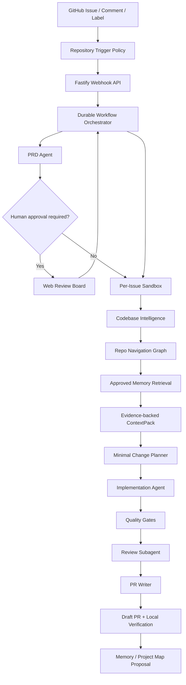

<div align="center">

# CodeZero

### From zero hand-written code to a verified pull request, powered by AI agents.

**English** · [中文](README.zh-CN.md)

</div>

CodeZero is a GitHub-native engineering agent platform for turning product intent into production-ready pull requests. Open an Issue, mention the agent, or trigger a repository workflow; CodeZero drafts the PRD, understands the codebase, plans the smallest safe change, writes the code in an isolated sandbox, verifies the result, reviews the diff, and opens a draft PR with local validation steps.

The idea is simple: humans write the intent, AI handles the code path. Not as a fragile one-shot prompt, but as a traceable engineering system with durable workflows, multi-agent orchestration, repository intelligence, sandbox execution, quality gates, memory governance, and human approval where it matters.

## Highlights

- **Issue to PRD to PR**: convert GitHub Issues into structured PRDs, implementation plans, verified diffs, and draft PRs.
- **Zero-code operator flow**: product or engineering leads describe what should change; agents handle the coding loop.
- **Repository intelligence**: initialize or refresh the upstream CodeGraph index, then build an evidence-backed ContextPack before editing.
- **Isolated execution**: each Issue runs in its own sandbox, branch, artifact set, and quality gate trail.
- **Human control**: PRD approval, policy gates, review subagents, and memory update proposals keep the system inspectable.
- **Local verification built in**: generated PRs include checkout, install, test, and run instructions.
- **OpenAI-compatible providers**: designed for OpenAI, DeepSeek, Qwen, or any compatible model gateway.
- **Operator console**: Run Console, Settings Console, Memory Inbox, Trace Replay API, and Golden Issue Eval CLI.

## Architecture



## How It Works

1. **Trigger**: GitHub webhook, `@agent` mention, label, or manual import creates a task.
2. **Understand**: the PRD agent extracts goals, risks, acceptance criteria, and complexity.
3. **Plan**: repository indexing, navigation graph, approved memory, and ContextPack narrow the work area.
4. **Implement**: the implementation agent makes the smallest safe code change in an isolated sandbox.
5. **Verify**: build, lint, test, typecheck, screenshot hooks, policy checks, and review subagents run before PR creation.
6. **Publish**: CodeZero pushes a branch and opens a draft PR with evidence, risks, and local verification commands.

## Monorepo Layout

```text
apps/
  api/       Fastify API, GitHub webhooks, settings and task routes
  web/       Next.js Run Console, Settings Console and Memory Inbox
  worker/    Workflow worker and repository task execution
packages/
  agent-runtime/          model provider and structured agent primitives
  codebase-intelligence/  indexing, hybrid search, ContextPack and repo graph
  config/                 YAML config loading and validation
  github/                 GitHub Issue, branch and PR integration
  memory/                 approved memory and memory proposal store
  orchestrator/           task state machine and workflow decisions
  persistence/            file/Postgres task persistence
  sandbox/                Docker/worktree sandbox abstraction
  skills/                 platform skill loader and built-in skills
  tool-gateway/           audited tool execution boundary
  verification/           test, screenshot and local verification helpers
  workflows/              issue-to-PR workflow composition
```

## Quick Start

```bash
pnpm install

cp .env.example .env
cp config/agents.example.yaml config/agents.yaml
cp config/repositories.example.yaml config/repositories.yaml
cp config/sandbox.example.yaml config/sandbox.yaml
cp config/policies.example.yaml config/policies.yaml
cp config/tools.example.yaml config/tools.yaml
```

Edit `.env` with an OpenAI-compatible model provider and GitHub token:

```bash
OPENAI_BASE_URL=https://api.openai.com/v1
OPENAI_API_KEY=...
OPENAI_MODEL=...
GITHUB_TOKEN=...
GITHUB_WEBHOOK_SECRET=...
AGENT_TRIGGER_MENTION=@agent-prd
```

Start local dependencies and services:

```bash
docker compose -f infra/docker/docker-compose.yml up -d

pnpm dev:api
pnpm dev:worker
pnpm dev:web
```

Open the web console at `http://localhost:3000`.

To generate and explore per-repository knowledge graphs from the repository cards, install the official
[Understand-Anything](https://github.com/Lum1104/Understand-Anything) Codex skill:

```bash
curl -fsSL https://raw.githubusercontent.com/Lum1104/Understand-Anything/main/install.sh | bash -s codex
```

The Run Console invokes the official `$understand` multi-agent pipeline and starts its official dashboard in the page. The output remains the upstream `.understand-anything/knowledge-graph.json`; the platform's lightweight graph is not substituted for it.

The Run Console defaults to Chinese and includes a Chinese/English switch. Agent PRD, planning, review notes and PR descriptions follow the Issue/PR comment language. Frontend screenshots are committed to `.agent/screenshots/` on the PR branch and embedded directly in the PR description as images. After PR creation, human comments in the same PR conversation update the same branch, rerun agent verification, refresh the original PR, and repeat until the user is ready to merge.

## Validation

```bash
pnpm check
pnpm eval:golden
```

`pnpm check` runs lint, typecheck, tests, and build. `pnpm eval:golden` scores the sample golden issues in `evals/golden-issues` against candidate artifacts and writes the report to `artifacts/eval-report.md`.

## Configuration

Runtime configuration lives in YAML files under `config/`:

- `agents.yaml`: model providers, agent roles, and routing.
- `repositories.yaml`: repository trigger policy, queue limits, and permissions.
- `sandbox.yaml`: execution mode, workspace paths, and sandbox settings.
- `policies.yaml`: approval rules, blocked paths, and guardrail policy.
- `tools.yaml`: tool gateway permissions and timeout defaults.

The Web Settings Console can edit and validate these files during local operation.

## Documentation

- [Documentation Index](docs/README.md)
- [System Architecture](docs/ARCHITECTURE.md)
- [Workflow Blueprint](docs/WORKFLOW_BLUEPRINT.md)
- [Operations Guide](docs/OPERATIONS.md)
- [Product Requirements](docs/PRD.md)
- [Repo Navigation Graph](docs/REPO_NAVIGATION_GRAPH.md)
- [Codebase Intelligence](docs/CODEBASE_INTELLIGENCE.md)
- [Memory Architecture](docs/MEMORY_ARCHITECTURE.md)
- [Prompt and Skill Design](docs/PROMPTS_AND_SKILLS.md)
- [Session Review](SESSION_REVIEW.md)

## Status

The MVP runs locally and includes GitHub Issue ingestion, repository trigger policy, repository queue and concurrency limits, PRD generation, conditional human PRD approval, Repo Navigation Graph MVP, ContextPack generation, an official Understand-Anything project graph entry point, a sandbox coding executor as the main implementation path, Tool Gateway JSON action compatibility fallback, Trace Replay API, Run Console, Settings Console, Memory Inbox, Golden Issue Eval CLI/CI, Repository Onboarding, sandbox execution, quality gates, Review subagent, and draft PR creation.

Next hardening areas include approval recovery, stricter tool input schemas, security scanning, richer eval assertions, and deeper graph adapters for larger repositories.
