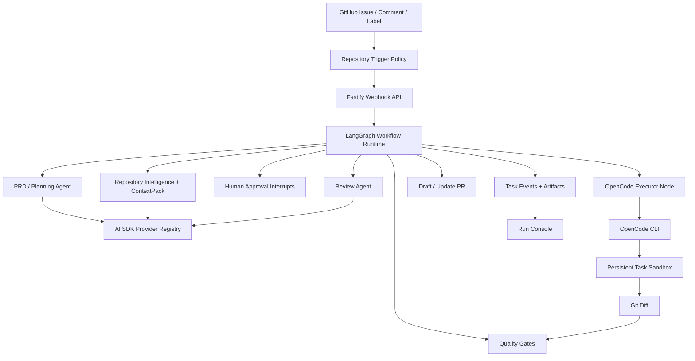

<div align="center">

<br />

<picture>
  <source media="(prefers-color-scheme: dark)" srcset="https://img.shields.io/badge/CodeZero-000000?style=for-the-badge&logo=github&logoColor=white&labelColor=000000">
</picture>

# CodeZero

### 无需人工编码，从需求到代码落地的自动化工作流

**写一个 Issue → 拿到一个验证过的 PR。**

[](LICENSE)
[](https://www.typescriptlang.org/)
[](https://langchain-ai.github.io/langgraph/)
[](https://sdk.vercel.ai/)

[English](README.en.md) · **中文**

---

</div>

<br />

## 展示

<div align="center">

<table>
<tr>
<td width="50%" align="center">

### Issue to Plan


</td>
<td width="50%" align="center">

### Plan to PR


</td>
</tr>
</table>

</div>

---

## 为什么选择 CodeZero？

CodeZero 覆盖的是**整条工程链路** —— 从产品意图到一个经过验证、可以 review 的 Pull Request。

<table>
<tr>
<td align="center" width="33%">
<h3>规划</h3>
<p>把 Issue 转化为结构化 PRD/Plan 文档：包含验收标准、风险分析、文件范围、测试项和命令。</p>
</td>
<td align="center" width="33%">
<h3>实现</h3>
<p>AI 编码 Agent 在持久沙箱中实现代码变更，stdout/stderr 实时流式推送到 Run Console。</p>
</td>
<td align="center" width="33%">
<h3>交付</h3>
<p>执行 build、lint、test、typecheck 和 review 门禁 —— 然后创建带验证证据和本地复现步骤的 draft PR。</p>
</td>
</tr>
</table>

---

## 核心能力

| 能力 | 说明 |
|:---|:---|
| **Issue → PRD → PR** | GitHub Issue 自动转化为结构化执行文档、验证后的 diff 和 draft PR |
| **LangGraph 编排** | 持久化 checkpoint，支持审批中断、进程重启恢复和可恢复修复循环 |
| **AI SDK 模型层** | 统一 provider registry，处理 PRD、review、context、validation 和 routing 调用，内置瞬时失败重试 |
| **实时 Agent 进度** | OpenCode 输出实时捕获为看板事件，随时查看 coding executor 在做什么 |
| **仓库智能理解** | CodeGraph + Navigation Graph + ContextPack 在改代码前收敛修改范围 |
| **持久 Task Sandbox** | 每个 Issue 一个 worktree 或 Docker 沙箱，跨审批、反馈迭代和重跑周期始终复用 |
| **Human-in-the-Loop** | PRD 审批、Policy 门禁、Review subagent 和 memory proposal 保持人可控 |
| **多供应商支持** | OpenAI、Anthropic、Gemini、xAI、Mistral、Groq —— 不同 agent 可路由到不同模型 |
| **操作台完整** | Run Console、Settings Console、Memory Inbox、Trace Replay API、Golden Issue Eval CLI |

---

## 运行保障

| 领域 | 当前实现 |
|:---|:---|
| Docker 隔离 | Docker 模式通过 `docker run` 执行命令，挂载 repo/artifacts/logs，默认 `--network none`，启用 `--cap-drop ALL`、`no-new-privileges`、memory、CPU 和 PID 限额；存在网络白名单时使用 bridge 并在命令层校验外联主机 |
| Worktree 沙箱 | Worktree 模式使用镜像仓库缓存和 `git worktree add --force -B` 创建真实 issue 分支工作区，不再只是普通目录 |
| Diff 限制 | 实现完成后按 `max_diff_files`、`max_diff_lines` 校验变更范围，超限会阻断进入 PR |
| LangGraph Checkpoint | 文件存储默认写入 `data/langgraph-checkpoints.json`；Postgres 存储启用时写入 `langgraph_checkpoints` 与 `langgraph_checkpoint_writes` |
| Trace Replay API | `GET /tasks/:id/trace/replay?cursor=&limit=` 返回步骤、失败点、分页游标和可用恢复动作 |
| Memory 系统 | `GET/PATCH/DELETE /memories/:id`、`POST /memories/prune` 支持编辑、删除、裁剪、容量限制和损坏文件隔离 |
| 稳定性 | Postgres DDL 每个 repository 实例只迁移一次；文件 JSON 损坏会隔离为 `.corrupt-*`；模型调用对超时、限流和网络瞬断进行重试 |
| Agent 能力 | PRD、搜索规划、实现、Review agent 均有默认配置；Review agent 注入 PR 合规、前端截图验证和后端测试验证 skill |

---

## 工作流程

```
  ┌─────────────┐     ┌──────────────┐     ┌──────────────┐     ┌─────────────┐
  │   触发任务   │────▶│   分析上下文  │────▶│   制定计划    │────▶│   人工审批   │
  │  (Issue /   │     │  (索引仓库,   │     │  (生成       │     │  (审核      │
  │   @提及)    │     │   构建上下文)  │     │   PRD/Plan)  │     │   PRD)     │
  └─────────────┘     └──────────────┘     └──────────────┘     └──────┬──────┘
                                                                       │
  ┌─────────────┐     ┌──────────────┐     ┌──────────────┐     ┌──────▼──────┐
  │   发布 PR   │◀────│   验证结果    │◀────│   流式观测    │◀────│  实现代码   │
  │  (Draft PR  │     │  (Build/Test/│     │  (实时看板    │     │  (OpenCode  │
  │   + 证据)   │     │   Review)    │     │   事件)      │     │   沙箱)     │
  └─────────────┘     └──────────────┘     └──────────────┘     └─────────────┘
```

1. **触发** — GitHub webhook、`@agent` 评论、标签或手动导入创建任务
2. **工作区** — 创建或复用持久 task sandbox 和 issue 分支
3. **分析** — 仓库索引、导航图、approved memory 和 ContextPack 找到最相关文件
4. **规划** — 一次 planning pass 生成 PRD/Plan 文档，用于审批和后续实现
5. **审批** — 需要人工审批时 LangGraph 中断运行，审批后在同一个 task thread 恢复
6. **实现** — OpenCode 使用生成的 prompt file 和模型配置，在同一个沙箱仓库内编辑
7. **流式** — executor 输出实时变成看板事件：进度、文件活动、命令和错误
8. **验证** — 运行 build、lint、test、typecheck、截图 hook、policy check 和 Review subagent
9. **发布** — 推送分支并创建 draft PR，附带证据、风险说明和本地验证命令

---

## 架构图



---

## Monorepo 结构

```text
apps/
  api/       Fastify API、GitHub webhook、settings routes、task routes
  web/       Next.js Run Console、Settings Console、Memory Inbox
  worker/    队列 worker 与仓库任务执行
packages/
  codebase-intelligence/  索引、混合搜索、ContextPack、repo graph
  config/                 YAML 配置加载与校验
  github/                 GitHub Issue、branch、comment、PR 集成
  memory/                 approved memory 与 memory proposal 存储
  model-runtime/          AI SDK 模型注册表与结构化 agent runner
  observability/          task traces 与可回放事件整理
  orchestrator/           任务状态机与 workflow 决策
  persistence/            文件/Postgres task 持久化
  sandbox/                Docker/worktree 沙箱抽象
  skills/                 平台 skill loader 与内置 skills
  verification/           测试、截图与本地验证辅助能力
  workflow-graph/         LangGraph task graph、checkpoint 与 callbacks
  workflows/              Issue-to-PR workflow 编排
```

---

## 快速开始

### 前置条件

- Node.js ≥ 20
- [pnpm](https://pnpm.io/) ≥ 10
- Docker（用于本地沙箱）
- [OpenCode CLI](https://github.com/opencode-ai/opencode) 在 `PATH` 中

### 安装

```bash
# 克隆仓库
git clone https://github.com/JASON-QWeb/CodeZero.git
cd CodeZero

# 安装依赖
pnpm install

# 配置环境变量
cp .env.example .env
```

### 配置

编辑 `.env`，填入 provider 和 GitHub 凭证：

```bash
OPENAI_BASE_URL=https://api.openai.com/v1
OPENAI_API_KEY=sk-...
OPENAI_MODEL=gpt-4o
# 推荐使用 GitHub App，这样 Issue 评论和 PR 会显示为 App/bot 身份。
GITHUB_APP_ID=123456
GITHUB_APP_INSTALLATION_ID=789012
GITHUB_APP_PRIVATE_KEY_PATH=./secrets/codezero-app.pem
# 未配置 GitHub App 时可用 PAT 作为 fallback。
GITHUB_TOKEN=ghp_...
GITHUB_WEBHOOK_SECRET=your-webhook-secret
AGENT_TRIGGER_MENTION=@codezero
```

如果同时配置了 `GITHUB_APP_*` 和 `GITHUB_TOKEN`，CodeZero 会优先使用 GitHub App installation token。本地运行建议使用 `GITHUB_APP_PRIVATE_KEY_PATH`；也可以用 `GITHUB_APP_PRIVATE_KEY`，但需要把换行写成 `\n`。

> **提示：** 之后也可以在 **Settings Console** UI 中切换活跃 provider 并保存 API key。

### 启动

```bash
# 启动基础设施
docker compose -f infra/docker/docker-compose.yml up -d

# 启动服务（分别在不同终端，或用 `pnpm dev` 一键全部启动）
pnpm dev:api      # API 服务
pnpm dev:worker   # 任务 Worker
pnpm dev:web      # Web 控制台
```

打开 **Web 控制台**：[`http://localhost:3000`](http://localhost:3000)

---

## OpenCode Executor

CodeZero 的实现路径是 **CLI-first**。默认沙箱 executor 会带着生成好的 prompt file 运行 OpenCode：

```bash
OPENCODE_BIN="${OPENCODE_BIN:-opencode}"
"$OPENCODE_BIN" run \
  --agent build \
  --model "$CODEZERO_OPENCODE_MODEL" \
  --variant "${CODEZERO_OPENCODE_VARIANT:-minimal}" \
  --format json \
  --dangerously-skip-permissions \
  "Implement the CodeZero request in the attached prompt file." \
  --file="$CODEZERO_PROMPT_FILE"
```

<details>
<summary><strong>供应商配置详情</strong></summary>

- 把 OpenCode 安装到 `PATH`，或在 `.env` 里设置 `OPENCODE_BIN` 指向本地二进制
- 对 **OpenAI-compatible 网关**，CodeZero 会写入临时 `OPENCODE_CONFIG`，映射 provider/model 且不暴露 API key
- **AI SDK 原生 provider**（Anthropic、Gemini、xAI、Mistral、Groq）默认走 OpenCode 的 native provider 路径
- 高级 executor 覆盖可配置在 `providers.<id>.coding_executor`

</details>

---

## 项目知识图

CodeZero 内置了轻量级仓库智能理解流程。如需更完整的项目知识图，安装官方 [Understand-Anything](https://github.com/Lum1104/Understand-Anything) Codex skill：

```bash
curl -fsSL https://raw.githubusercontent.com/Lum1104/Understand-Anything/main/install.sh | bash -s codex
```

Run Console 会运行官方 `$understand` 多 Agent pipeline 并在页面内渲染 dashboard。产物保持为上游定义的 `.understand-anything/knowledge-graph.json`。

---

## 验证命令

```bash
pnpm check          # Lint + Typecheck + 带 Coverage 的测试 + Build
pnpm eval:golden    # 使用 golden issues 评估候选产物
```

评估报告写入 `artifacts/eval-report.md`。

---

## 配置

运行配置位于 `config/` 目录：

| 文件 | 用途 |
|:---|:---|
| `codezero.yaml` | 模型 provider、agent 角色、仓库、沙箱、memory、workflow graph、policy 和 tool gateway 默认值 |
| `codezero.example.yaml` | 新安装可参考的干净模板 |

本地运行时也可通过 **Settings Console** UI 编辑和校验这些配置。

---

## 开源协议

CodeZero 基于 [MIT License](LICENSE) 开源。

---
