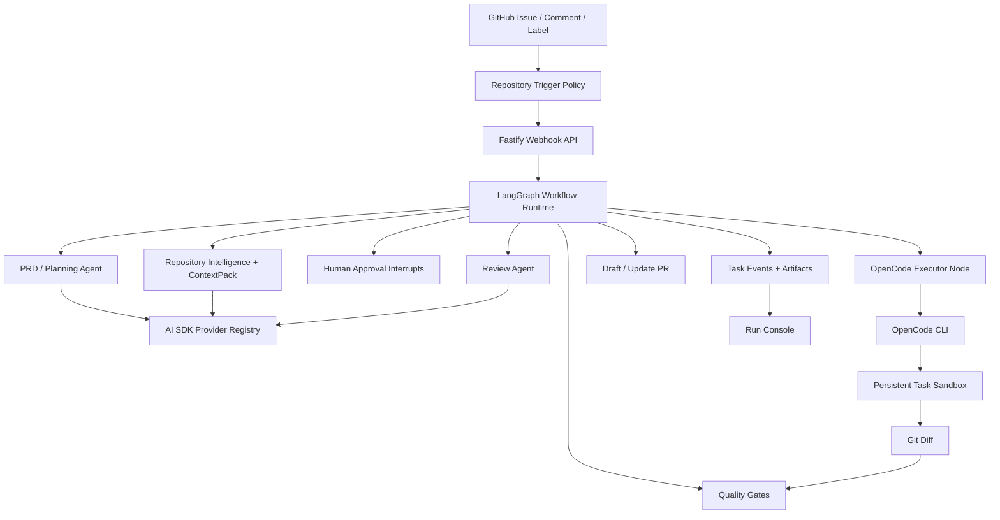

<div align="center">

<br />

<picture>
  <source media="(prefers-color-scheme: dark)" srcset="https://img.shields.io/badge/CodeZero-000000?style=for-the-badge&logo=github&logoColor=white&labelColor=000000">
  
</picture>

# CodeZero

### GitHub Issues in. Verified Pull Requests out.

**The AI engineering agent that turns product intent into production-ready, reviewable PRs — autonomously.**

[](LICENSE)
[](https://www.typescriptlang.org/)
[](https://langchain-ai.github.io/langgraph/)
[](https://sdk.vercel.ai/)
[](https://pnpm.io/)

**English** · [中文](README.zh-CN.md) · [Documentation](docs/README.md)

---

**⚡ Write an Issue → Get a verified PR. That's it.**

</div>

<br />

## 🎬 Showcase

<!-- 
  GIF placeholders — replace the comments below with your actual GIF paths or URLs.
  Example: 
-->

<div align="center">

<!--  -->
> 🎥 **Issue → PRD Generation** — _GIF coming soon_

<!--  -->
> 🎥 **Live Agent Coding Progress** — _GIF coming soon_

<!--  -->
> 🎥 **Auto Draft PR with Verification Evidence** — _GIF coming soon_

</div>

---

## ✨ Why CodeZero?

Most AI coding tools stop at **code generation**. CodeZero handles the **entire engineering workflow** — from product intent to a verified, reviewable pull request.

<table>
<tr>
<td width="50%" valign="top">

### 🔴 Without CodeZero
- Write ticket → manually break it down
- Context switch to IDE → figure out which files to edit
- Write code → run tests → fix → repeat
- Open PR → wait for review → fix → repeat
- **Hours to days per feature**

</td>
<td width="50%" valign="top">

### 🟢 With CodeZero
- Write a GitHub Issue in natural language
- CodeZero reads your repo, drafts a PRD, gets approval
- Agent codes in an isolated sandbox with live progress
- Auto-runs verification, opens a draft PR with evidence
- **Minutes to hours per feature**

</td>
</tr>
</table>

---

## 🚀 What It Does

<table>
<tr>
<td align="center" width="33%">
<h3>📋 Plan</h3>
<p>Converts Issues into structured PRD/Plan documents with acceptance criteria, risks, file analysis, tests, and commands.</p>
</td>
<td align="center" width="33%">
<h3>🤖 Build</h3>
<p>An AI coding agent implements changes in a persistent sandbox with live stdout/stderr streaming to the Run Console.</p>
</td>
<td align="center" width="33%">
<h3>✅ Ship</h3>
<p>Runs build, lint, test, typecheck, and review gates — then opens a draft PR with verification evidence and local repro steps.</p>
</td>
</tr>
</table>

---

## 🏗️ Key Features

| Feature | Description |
|:---|:---|
| **Issue → PRD → PR** | Transforms GitHub Issues into structured planning documents, verified diffs, and draft PRs |
| **LangGraph Orchestration** | Checkpointed graph nodes with approval interrupts and resumable repair loops |
| **AI SDK Model Layer** | Unified provider registry for PRD, review, context, validation, and routing agents |
| **Live Agent Progress** | Real-time streaming of coding agent output as board events |
| **OpenCode-First Execution** | CLI-native code editing via OpenCode — no legacy JSON file-write hacks |
| **Repository Intelligence** | CodeGraph + Navigation Graph + ContextPack narrow the edit surface before changes begin |
| **Persistent Task Sandbox** | One sandbox per Issue — survives approval cycles, feedback iterations, and reruns |
| **Human-in-the-Loop** | PRD approval, policy gates, review subagents, and memory proposals keep humans in control |
| **Multi-Provider Support** | OpenAI, Anthropic, Gemini, xAI, Mistral, Groq — route different agents to different models |
| **Operator Console** | Run Console, Settings Console, Memory Inbox, Trace Replay API, Golden Issue Eval CLI |

---

## 🔄 How It Works

```
  ┌─────────────┐     ┌──────────────┐     ┌──────────────┐     ┌─────────────┐
  │   Trigger    │────▶│   Analyze    │────▶│    Plan      │────▶│   Approve   │
  │  (Issue /    │     │  (Index repo,│     │  (Generate   │     │  (Human     │
  │   @mention)  │     │   context)   │     │   PRD/Plan)  │     │   review)   │
  └─────────────┘     └──────────────┘     └──────────────┘     └──────┬──────┘
                                                                       │
  ┌─────────────┐     ┌──────────────┐     ┌──────────────┐     ┌──────▼──────┐
  │   Ship PR   │◀────│   Verify     │◀────│   Stream     │◀────│  Implement  │
  │  (Draft PR  │     │  (Build/Test/│     │  (Live board │     │  (OpenCode  │
  │   + evidence│     │   Review)    │     │   events)    │     │   sandbox)  │
  └─────────────┘     └──────────────┘     └──────────────┘     └─────────────┘
```

1. **Trigger** — GitHub webhook, `@agent` mention, label, or manual import creates a task
2. **Workspace** — Creates or reuses the persistent task sandbox and issue branch
3. **Analyze** — Repository indexing, navigation graph, approved memory, and ContextPack identify relevant files
4. **Plan** — One planning pass produces the PRD/Plan document for approval and implementation
5. **Approve** — LangGraph interrupts when human approval is needed, then resumes the same thread
6. **Implement** — OpenCode edits the sandboxed repository using the generated prompt and model config
7. **Stream** — Executor output becomes real-time board events: progress, files, commands, errors
8. **Verify** — Build, lint, test, typecheck, screenshots, policy checks, and review subagents run
9. **Ship** — Pushes branch and opens a draft PR with evidence, risks, and local verification commands

---

## 🏛️ Architecture



---

## 📁 Monorepo Layout

```text
apps/
  api/       Fastify API, GitHub webhooks, settings routes, task routes
  web/       Next.js Run Console, Settings Console, Memory Inbox
  worker/    Queue worker and repository task execution
packages/
  codebase-intelligence/  Indexing, hybrid search, ContextPack, repo graph
  config/                 YAML config loading and validation
  github/                 GitHub Issue, branch, comment, PR integration
  memory/                 Approved memory and memory proposal store
  model-runtime/          AI SDK model registry and structured agent runner
  observability/          Task traces and replay-friendly event shaping
  orchestrator/           Task state machine and workflow decisions
  persistence/            File/Postgres task persistence
  sandbox/                Docker/worktree sandbox abstraction
  skills/                 Platform skill loader and built-in skills
  tool-gateway/           Audited read/search/shell tool boundary
  verification/           Test, screenshot, and local verification helpers
  workflow-graph/         LangGraph task graph, checkpoints, callbacks
  workflows/              Issue-to-PR workflow composition
```

---

## ⚡ Quick Start

### Prerequisites

- Node.js ≥ 20
- [pnpm](https://pnpm.io/) ≥ 10
- Docker (for local sandbox)
- [OpenCode CLI](https://github.com/opencode-ai/opencode) on `PATH`

### Installation

```bash
# Clone the repository
git clone https://github.com/JASON-QWeb/CodeZero.git
cd CodeZero

# Install dependencies
pnpm install

# Configure environment
cp .env.example .env
```

### Configuration

Edit `.env` with your provider and GitHub credentials:

```bash
OPENAI_BASE_URL=https://api.openai.com/v1
OPENAI_API_KEY=sk-...
OPENAI_MODEL=gpt-4o
GITHUB_TOKEN=ghp_...
GITHUB_WEBHOOK_SECRET=your-webhook-secret
AGENT_TRIGGER_MENTION=@codezero
```

> 💡 **Tip:** You can switch providers and save API keys later from the **Settings Console** UI.

### Launch

```bash
# Start infrastructure
docker compose -f infra/docker/docker-compose.yml up -d

# Start services (in separate terminals or use `pnpm dev` for all)
pnpm dev:api      # API server
pnpm dev:worker   # Task worker
pnpm dev:web      # Web console
```

Open the **Run Console** at [`http://localhost:3000`](http://localhost:3000) 🎉

### Mock Data Mode

For screenshots or GIF capture, enable deterministic frontend mock data without starting the API, worker, GitHub sync, or local repository indexing:

```bash
NEXT_PUBLIC_MOCK_DATA=1 pnpm dev:web
```

Mock data mode uses the configured project repositories, fixed timestamps, sanitized settings, generated trace events, CodeGraph summaries, context files, and proposed memories. Runtime artifacts still write to local ignored folders such as `output/`.

---

## 🔧 OpenCode Executor

CodeZero's implementation path is **CLI-first**. The default sandbox executor runs OpenCode with a generated prompt file:

```bash
OPENCODE_BIN="${OPENCODE_BIN:-opencode}"
"$OPENCODE_BIN" run \
  --agent build \
  --model "$CODEZERO_OPENCODE_MODEL" \
  --variant "${CODEZERO_OPENCODE_VARIANT:-minimal}" \
  --format json \
  --dangerously-skip-permissions \
  "Implement the CodeZero request in the attached prompt file." \
  --file="$CODEZERO_PROMPT_FILE"
```

<details>
<summary><strong>Provider Configuration Details</strong></summary>

- Install OpenCode on `PATH`, or set `OPENCODE_BIN` in `.env` to a local binary
- For **OpenAI-compatible gateways**, CodeZero writes a temporary `OPENCODE_CONFIG` that maps provider/model without exposing API keys in artifacts
- **Native AI SDK providers** (Anthropic, Gemini, xAI, Mistral, Groq) use OpenCode's native provider path by default
- Advanced executor overrides can be configured under `providers.<id>.coding_executor`

</details>

---

## 🧠 Knowledge Graphs

CodeZero includes a lightweight repository intelligence pipeline. For richer, per-repository knowledge graphs, install the official [Understand-Anything](https://github.com/Lum1104/Understand-Anything) Codex skill:

```bash
curl -fsSL https://raw.githubusercontent.com/Lum1104/Understand-Anything/main/install.sh | bash -s codex
```

The Run Console invokes the official `$understand` multi-agent pipeline and renders its dashboard inline. Output remains the upstream `.understand-anything/knowledge-graph.json`.

---

## 🧪 Validation

```bash
pnpm check          # Lint + Typecheck + Tests (with coverage) + Build
pnpm eval:golden    # Score golden issues against candidate artifacts
```

Eval reports are written to `artifacts/eval-report.md`.

---

## ⚙️ Configuration

Runtime configuration lives in `config/`:

| File | Purpose |
|:---|:---|
| `codezero.yaml` | Model providers, agent roles, repositories, sandbox, policies, tool gateway |
| `codezero.example.yaml` | Clean template for new installations |

The **Settings Console** UI can edit and validate these files during local operation.

---

## 📝 Operator Notes

- Agent-generated PRDs, plans, reviews, and PR descriptions follow the Issue/comment language
- Frontend screenshots are stored as task artifacts (not committed to the target branch)
- Post-PR-creation, human comments in the same PR conversation trigger re-implementation on the same branch

---

## 📄 License

CodeZero is licensed under the [MIT License](LICENSE).

---
