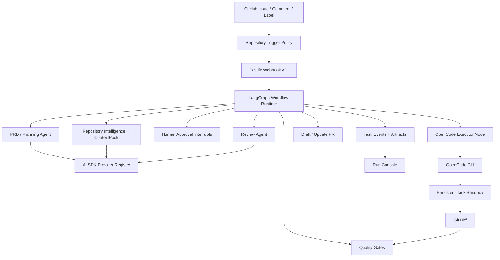

<div align="center">

# CodeZero

### GitHub Issues in, verified pull requests out.

**English** · [中文](README.zh-CN.md)

</div>

CodeZero is a GitHub-native engineering agent platform that turns product intent into reviewable, verified pull requests. Describe the change in an Issue, mention the agent, or let a repository policy trigger the run. CodeZero creates one persistent task sandbox, reads the repository, builds a focused context pack, drafts one PRD/Plan document, asks a coding agent to edit in that same sandbox after approval, streams the work back to the board, runs verification, reviews the diff, and opens a draft PR with local validation steps.

It is built for the messy middle between "I have an idea" and "this PR is ready for a human review." Instead of treating code generation as a one-shot prompt, CodeZero wraps it in durable workflow state, repository intelligence, isolated execution, quality gates, traceable events, and approval points where people should stay in control.

## What It Feels Like

- Open a GitHub Issue and write the product intent in natural language.
- CodeZero turns that intent and repository context into one PRD/Plan document: acceptance criteria, risks, files, tests, and commands.
- The implementation agent works through OpenCode in an isolated sandbox, with stdout/stderr and structured progress streamed to the Run Console.
- The board shows where the run is: syncing, indexing, planning, coding, reviewing, blocked, failed, or ready.
- A draft PR appears with the diff, verification evidence, risks, and the exact commands a maintainer can run locally.

## Highlights

- **Issue to PRD/Plan to PR**: convert GitHub Issues into one structured planning document, verified diffs, and draft PRs.
- **LangGraph orchestration**: issue workflows run through checkpointed graph nodes with approval interrupts and resumable repair loops.
- **AI SDK model layer**: CodeZero platform agents use one provider registry for PRD, review, context, provider validation, and routing calls.
- **Live agent progress**: OpenCode output is captured as task events, so the board can show what the coding executor is doing.
- **OpenCode-first implementation**: the main code path delegates edits to a coding CLI executor instead of legacy JSON file-write actions.
- **Repository intelligence**: CodeGraph, Repo Navigation Graph, approved memory, and ContextPack narrow the edit surface before code changes begin.
- **Persistent task sandbox**: each Issue receives one sandbox, branch, artifact set, logs, and verification trail that continue through approval and feedback iterations.
- **Human control**: PRD approval, policy gates, review subagents, and memory proposals keep sensitive steps inspectable.
- **Provider flexibility**: works with OpenAI-compatible gateways and can route agents across different providers and models.
- **Operator console**: Run Console, Settings Console, Memory Inbox, Trace Replay API, and Golden Issue Eval CLI are included.

## Architecture



## How It Works

1. **Trigger**: GitHub webhook, `@agent` mention, label, or manual import creates a task.
2. **Open Workspace**: CodeZero creates or reuses the task sandbox and issue branch.
3. **Orient**: repository indexing, navigation graph, approved memory, and ContextPack identify the relevant files.
4. **Plan**: one planning pass produces the PRD/Plan document used for approval and implementation.
5. **Approve or resume**: LangGraph interrupts the run when human approval or feedback is required, then resumes the same task thread.
6. **Implement**: after approval, OpenCode edits the same sandboxed repository using the generated prompt file and model configuration.
7. **Stream**: executor stdout/stderr and structured JSON lines become board events such as progress, file activity, commands, and errors.
8. **Verify**: build, lint, test, typecheck, screenshot hooks, policy checks, and review subagents run before PR creation.
9. **Publish**: CodeZero pushes a branch and opens a draft PR with evidence, risks, and local verification commands.

## Monorepo Layout

```text
apps/
  api/       Fastify API, GitHub webhooks, settings routes, task routes
  web/       Next.js Run Console, Settings Console, Memory Inbox
  worker/    Queue worker and repository task execution
packages/
  codebase-intelligence/  indexing, hybrid search, ContextPack, repo graph
  config/                 YAML config loading and validation
  github/                 GitHub Issue, branch, comment, PR integration
  memory/                 approved memory and memory proposal store
  model-runtime/          AI SDK model registry and structured agent runner
  observability/          task traces and replay-friendly event shaping
  orchestrator/           task state machine and workflow decisions
  persistence/            file/Postgres task persistence
  sandbox/                Docker/worktree sandbox abstraction
  skills/                 platform skill loader and built-in skills
  tool-gateway/           audited read/search/shell tool boundary
  verification/           test, screenshot, and local verification helpers
  workflow-graph/         LangGraph task graph, checkpoints, callbacks
  workflows/              Issue-to-PR workflow composition
```

## Quick Start

```bash
pnpm install

cp .env.example .env
```

Edit `.env` with the default provider and GitHub token. You can switch the active provider and save its API key later from Settings Console.

```bash
OPENAI_BASE_URL=https://api.openai.com/v1
OPENAI_API_KEY=...
OPENAI_MODEL=...
GITHUB_TOKEN=...
GITHUB_WEBHOOK_SECRET=...
AGENT_TRIGGER_MENTION=@codezero
```

Start local dependencies and services:

```bash
docker compose -f infra/docker/docker-compose.yml up -d

pnpm dev:api
pnpm dev:worker
pnpm dev:web
```

Open the web console at `http://localhost:3000`.

## OpenCode Executor

CodeZero's implementation path is CLI-first. The default sandbox executor runs OpenCode with a generated prompt file:

```bash
OPENCODE_BIN="${OPENCODE_BIN:-opencode}"
"$OPENCODE_BIN" run \
  --agent build \
  --model "$CODEZERO_OPENCODE_MODEL" \
  --variant "${CODEZERO_OPENCODE_VARIANT:-minimal}" \
  --format json \
  --dangerously-skip-permissions \
  "Implement the CodeZero request in the attached prompt file." \
  --file="$CODEZERO_PROMPT_FILE"
```

Install OpenCode on `PATH`, or set `OPENCODE_BIN` in `.env` to a local OpenCode binary. For OpenAI-compatible gateways, CodeZero writes a temporary `OPENCODE_CONFIG` file that maps the configured provider/model into OpenCode without placing API keys in artifacts. Native AI SDK providers such as Anthropic, Google Gemini, xAI, Mistral and Groq use OpenCode's native provider path by default. Advanced executor overrides can live under `providers.<id>.coding_executor`.

## Knowledge Graphs

CodeZero has a lightweight repository intelligence pipeline built in. To generate and explore richer per-repository knowledge graphs from repository cards, install the official [Understand-Anything](https://github.com/Lum1104/Understand-Anything) Codex skill:

```bash
curl -fsSL https://raw.githubusercontent.com/Lum1104/Understand-Anything/main/install.sh | bash -s codex
```

The Run Console invokes the official `$understand` multi-agent pipeline and starts its official dashboard in the page. The output remains the upstream `.understand-anything/knowledge-graph.json`; the platform's lightweight graph is not substituted for it.

## Operator Notes

The Run Console defaults to Chinese and includes a Chinese/English switch. Agent PRDs, plans, review notes, and PR descriptions follow the Issue or PR comment language.

Frontend screenshots are stored as CodeZero task artifacts and referenced from the PR verification section without committing image files to the target repository branch. If an external public image URL is configured, CodeZero can still render it inline in the PR description. After PR creation, human comments in the same PR conversation update the same branch, rerun verification, refresh the original PR, and repeat until the user is ready to merge.

## Validation

```bash
pnpm check
pnpm eval:golden
```

`pnpm check` runs lint, typecheck, tests with coverage, and build. `pnpm eval:golden` scores the sample golden issues in `evals/golden-issues` against candidate artifacts and writes the report to `artifacts/eval-report.md`.

## Configuration

Runtime configuration lives in one YAML file under `config/`:

- `codezero.yaml`: model providers, agent roles, repositories, sandbox, policies, and tool gateway defaults.
- `codezero.example.yaml`: clean template for new installations.

The Web Settings Console can edit and validate these files during local operation.

## Documentation

- [Documentation Index](docs/README.md)
- [Architecture](docs/ARCHITECTURE.md)
- [Refactor Plan](docs/REFACTOR_PLAN.md)

## Current Status

The runtime is now organized around AI SDK for model access, LangGraph for workflow orchestration, and OpenCode for sandbox code execution. Runtime config is consolidated in `config/codezero.yaml`; `packages/model-runtime` compiles that config for both platform agents and OpenCode; the worker enters `packages/workflow-graph` for issue execution.
