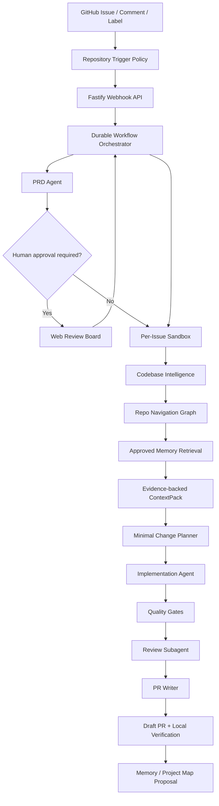

# Agent PRD Automation

Agent PRD Automation is a GitHub-native engineering agent platform. It turns an Issue or `@agent` comment into an auditable product-to-code workflow: draft a PRD, build repository context, implement the smallest safe change in an isolated sandbox, run quality gates, review the diff, and open a draft PR with local verification instructions.

The project is designed as a production-grade agent system rather than a one-shot code generation demo. It focuses on durable workflows, multi-agent orchestration, repository intelligence, memory governance, sandbox execution, traceable artifacts, and human-in-the-loop controls.

## What It Does

- Ingests GitHub Issues, labels, comments, and manual imports.
- Applies repository-level trigger policy: `auto`, `mention`, `label`, `manual`, or `disabled`.
- Drafts structured PRDs with complexity scoring and human approval gates.
- Creates an isolated sandbox and issue branch for each task.
- Builds a Repo Navigation Graph and evidence-backed ContextPack before editing code.
- Routes work through implementation, verification, review, and PR-writing agents.
- Runs build, lint, test, typecheck, policy checks, and frontend screenshot verification hooks.
- Creates draft PRs with PRD summary, risk notes, test evidence, and local checkout commands.
- Provides a Run Console, Settings Console, Memory Inbox, Trace Replay API, and Golden Issue Eval CLI.

## Architecture



## Monorepo Layout

```text
apps/
  api/       Fastify API, GitHub webhooks, settings and task routes
  web/       Next.js Run Console, Settings Console and Memory Inbox
  worker/    Workflow worker and repository task execution
packages/
  agent-runtime/          model provider and structured agent primitives
  codebase-intelligence/  indexing, hybrid search, ContextPack and repo graph
  config/                 YAML config loading and validation
  github/                 GitHub Issue, branch and PR integration
  memory/                 approved memory and memory proposal store
  orchestrator/           task state machine and workflow decisions
  persistence/            file/Postgres task persistence
  sandbox/                Docker/worktree sandbox abstraction
  skills/                 platform skill loader and built-in skills
  tool-gateway/           audited tool execution boundary
  verification/           test, screenshot and local verification helpers
  workflows/              issue-to-PR workflow composition
```

## Quick Start

```bash
pnpm install

cp .env.example .env
cp config/agents.example.yaml config/agents.yaml
cp config/repositories.example.yaml config/repositories.yaml
cp config/sandbox.example.yaml config/sandbox.yaml
cp config/policies.example.yaml config/policies.yaml
cp config/tools.example.yaml config/tools.yaml
```

Edit `.env` with an OpenAI-compatible model provider and GitHub token:

```bash
OPENAI_BASE_URL=https://api.openai.com/v1
OPENAI_API_KEY=...
OPENAI_MODEL=...
GITHUB_TOKEN=...
GITHUB_WEBHOOK_SECRET=...
AGENT_TRIGGER_MENTION=@agent-prd
```

Start local dependencies and services:

```bash
docker compose -f infra/docker/docker-compose.yml up -d

pnpm dev:api
pnpm dev:worker
pnpm dev:web
```

Open the web console at `http://localhost:3000`.

## Validation

```bash
pnpm check
pnpm eval:golden
```

`pnpm check` runs lint, typecheck, tests, and build. `pnpm eval:golden` scores the sample golden issues in `evals/golden-issues` against candidate artifacts and writes the report to `artifacts/eval-report.md`.

## Configuration

Runtime configuration lives in YAML files under `config/`:

- `agents.yaml`: model providers, agent roles, and routing.
- `repositories.yaml`: repository trigger policy, queue limits, and permissions.
- `sandbox.yaml`: execution mode, workspace paths, and sandbox settings.
- `policies.yaml`: approval rules, blocked paths, and guardrail policy.
- `tools.yaml`: tool gateway permissions and timeout defaults.

The Web Settings Console can edit and validate these files during local operation.

## Documentation

- [Documentation Index](docs/README.md)
- [System Architecture](docs/ARCHITECTURE.md)
- [Workflow Blueprint](docs/WORKFLOW_BLUEPRINT.md)
- [Operations Guide](docs/OPERATIONS.md)
- [Product Requirements](docs/PRD.md)
- [Repo Navigation Graph](docs/REPO_NAVIGATION_GRAPH.md)
- [Codebase Intelligence](docs/CODEBASE_INTELLIGENCE.md)
- [Memory Architecture](docs/MEMORY_ARCHITECTURE.md)
- [Prompt and Skill Design](docs/PROMPTS_AND_SKILLS.md)

Historical planning notes are kept in [docs/archive](docs/archive/).

## Current Status

The MVP runs locally and includes GitHub Issue ingestion, repository trigger policy, repository queue and concurrency limits, PRD generation, human PRD approval, Repo Navigation Graph MVP, ContextPack generation, Tool Gateway JSON action fallback, Trace Replay API, Run Console, Settings Console, Memory Inbox, Golden Issue Eval CLI/CI, Repository Onboarding, sandbox execution, quality gates, Review subagent, and draft PR creation.

The next product hardening areas are approval recovery, stricter tool input schemas, security scanning, richer eval assertions, and deeper graph adapters for larger repositories.
