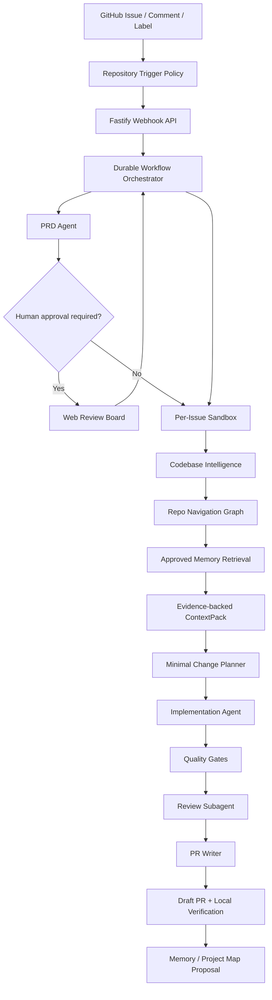

<div align="center">

# Code零

### 人只写需求，AI 写完全部代码，并把结果验证成 PR。

[English](README.md) · **中文**

</div>

Code零 是一个面向 GitHub 的工程 Agent 平台，用来把产品意图自动推进到可审核、可验证的 Pull Request。你只需要创建 Issue、`@agent` 评论，或通过仓库策略触发任务；Code零 会生成 PRD，理解代码仓库，规划最小安全改动，在隔离沙箱中完成代码，实现后跑质量门禁、做差异审核，并创建带本地验证指令的 draft PR。

它的核心想法很直接：人负责表达意图，AI 负责走完整个编码路径。它不是一次性 prompt 生成代码的 demo，而是一套可追踪的工程系统，覆盖 durable workflow、多 Agent 编排、仓库智能理解、沙箱执行、质量门禁、记忆治理和必要的人审控制。

## 项目亮点

- **Issue 到 PRD 到 PR**：把 GitHub Issue 转成结构化 PRD、实现计划、验证后的 diff 和 draft PR。
- **零代码操作流**：产品或工程负责人描述“要改什么”，Agent 处理代码实现闭环。
- **仓库智能理解**：修改前初始化或刷新上游 CodeGraph 索引，并构建带证据链的 ContextPack。
- **隔离执行**：每个 Issue 拥有独立沙箱、独立分支、独立产物和独立质量门禁记录。
- **人可控**：PRD 审批、Policy 门禁、Review subagent 和 memory update proposal 让每一步可检查。
- **PR 可本地验证**：生成的 PR 自动包含 checkout、安装、测试和启动验证指令。
- **兼容多模型接口**：面向 OpenAI、DeepSeek、Qwen 或任何 OpenAI-compatible 模型网关。
- **运行控制台**：提供 Run Console、Settings Console、Memory Inbox、Trace Replay API 和 Golden Issue Eval CLI。

## 架构图



## 工作流程

1. **触发任务**：GitHub webhook、`@agent` 评论、标签或手动导入创建任务。
2. **理解需求**：PRD Agent 提取目标、风险、验收标准和复杂度。
3. **规划上下文**：通过仓库索引、导航图、approved memory 和 ContextPack 收敛修改范围。
4. **实现代码**：Implementation Agent 在隔离沙箱中执行最小安全改动。
5. **验证结果**：运行 build、lint、test、typecheck、截图 hook、policy check 和 Review subagent。
6. **创建 PR**：Code零 推送分支并创建 draft PR，附带证据、风险说明和本地验证命令。

## Monorepo 结构

```text
apps/
  api/       Fastify API、GitHub webhook、settings 与 task routes
  web/       Next.js Run Console、Settings Console 与 Memory Inbox
  worker/    workflow worker 与仓库任务执行
packages/
  agent-runtime/          model provider 与结构化 agent 基础能力
  codebase-intelligence/  索引、混合搜索、ContextPack 与 repo graph
  config/                 YAML 配置加载与校验
  github/                 GitHub Issue、branch 与 PR 集成
  memory/                 approved memory 与 memory proposal 存储
  orchestrator/           任务状态机与 workflow 决策
  persistence/            文件/Postgres task 持久化
  sandbox/                Docker/worktree 沙箱抽象
  skills/                 平台 skill loader 与内置 skills
  tool-gateway/           可审计的工具执行边界
  verification/           测试、截图与本地验证辅助能力
  workflows/              Issue-to-PR workflow 编排
```

## 快速开始

```bash
pnpm install

cp .env.example .env
cp config/agents.example.yaml config/agents.yaml
cp config/repositories.example.yaml config/repositories.yaml
cp config/sandbox.example.yaml config/sandbox.yaml
cp config/policies.example.yaml config/policies.yaml
cp config/tools.example.yaml config/tools.yaml
```

编辑 `.env`，配置 OpenAI-compatible 模型服务和 GitHub token：

```bash
OPENAI_BASE_URL=https://api.openai.com/v1
OPENAI_API_KEY=...
OPENAI_MODEL=...
GITHUB_TOKEN=...
GITHUB_WEBHOOK_SECRET=...
AGENT_TRIGGER_MENTION=@agent-prd
```

启动本地依赖和服务：

```bash
docker compose -f infra/docker/docker-compose.yml up -d

pnpm dev:api
pnpm dev:worker
pnpm dev:web
```

打开 Web 控制台：`http://localhost:3000`。

## 验证命令

```bash
pnpm check
pnpm eval:golden
```

`pnpm check` 会运行 lint、typecheck、tests 和 build。`pnpm eval:golden` 会使用 `evals/golden-issues` 中的样例评估候选产物，并把报告写入 `artifacts/eval-report.md`。

## 配置

运行配置位于 `config/` 目录：

- `agents.yaml`：模型 provider、agent 角色和模型路由。
- `repositories.yaml`：仓库触发策略、队列限制和权限。
- `sandbox.yaml`：执行模式、workspace 路径和沙箱设置。
- `policies.yaml`：审批规则、禁改路径和 guardrail policy。
- `tools.yaml`：tool gateway 权限和超时默认值。

本地运行时也可以通过 Web Settings Console 编辑和校验这些配置。

## 文档

- [文档索引](docs/README.md)
- [系统架构](docs/ARCHITECTURE.md)
- [流程蓝图](docs/WORKFLOW_BLUEPRINT.md)
- [运行指南](docs/OPERATIONS.md)
- [产品需求文档](docs/PRD.md)
- [Repo Navigation Graph](docs/REPO_NAVIGATION_GRAPH.md)
- [Codebase Intelligence](docs/CODEBASE_INTELLIGENCE.md)
- [记忆架构](docs/MEMORY_ARCHITECTURE.md)
- [Prompt 与 Skill 设计](docs/PROMPTS_AND_SKILLS.md)

历史规划文档统一存放在 [docs/archive](docs/archive/)。

## 当前状态

MVP 已可本地运行，包含 GitHub Issue 接入、仓库触发策略、仓库队列与并发限制、PRD 生成、人工 PRD 审批、Repo Navigation Graph MVP、ContextPack 生成、Tool Gateway JSON action fallback、Trace Replay API、Run Console、Settings Console、Memory Inbox、Golden Issue Eval CLI/CI、Repository Onboarding、沙箱执行、质量门禁、Review subagent 和 draft PR 创建。

下一步重点是审批恢复、更严格的 tool input schema、安全扫描、更丰富的 eval assertion，以及面向大仓库的更深层图适配器。
