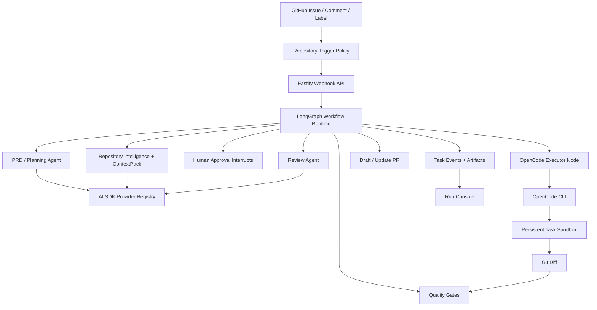

<div align="center">

# CodeZero

### 无需人工编码，从需求到代码落地的自动化工作流

[English](README.md) · **中文**

</div>

CodeZero：把产品意图推进成可审核、可验证的 Pull Request。你可以创建 Issue、评论里 `@agent`，也可以交给仓库策略自动触发。CodeZero 会创建一个持续复用的 task sandbox，阅读仓库，构建聚焦的上下文包，生成一份 PRD/Plan 文档；批准后把实现交给同一个沙箱里的 coding agent，实时把执行进度显示到看板，跑完验证、复审 diff，最后创建带本地验证指令的 draft PR。

它处理的是从“我有个想法”到“这份 PR 可以让人 review 了”之间那段最容易卡住的工程过程。CodeZero 不把代码生成当成一次性 prompt，而是把它放进 durable workflow、仓库智能理解、隔离执行、质量门禁、可追踪事件和必要的人审节点里。

## 用起来是什么感觉

- 在 GitHub Issue 里用自然语言描述产品意图。
- CodeZero 把意图和代码上下文整理成同一份 PRD/Plan 文档：验收标准、风险、文件、测试和命令都在里面。
- Implementation Agent 通过 OpenCode 在隔离沙箱里改代码，stdout/stderr 和结构化进度会流式进入 Run Console。
- 看板能看到任务卡在哪一步：同步中、索引中、规划中、实现中、Review 中、阻塞、失败或待合并。
- 最终得到一个 draft PR，里面有 diff、验证证据、风险说明，以及维护者本地复现用的命令。

## 项目亮点

- **Issue 到 PRD/Plan 到 PR**：把 GitHub Issue 转成一份结构化执行文档、验证后的 diff 和 draft PR。
- **LangGraph 编排**：Issue workflow 通过可 checkpoint 的图节点运行，支持审批 interrupt 和可恢复修复循环。
- **AI SDK 模型层**：CodeZero 平台 agent 用同一个 provider registry 处理 PRD、review、context、provider validation 和 routing 调用。
- **实时 Agent 进度**：OpenCode 输出会被捕获成 task events，看板能显示 coding executor 正在做什么。
- **OpenCode-first 实现路径**：主实现流程交给 coding CLI executor，不再依赖旧的 JSON 文件写入动作。
- **仓库智能理解**：CodeGraph、Repo Navigation Graph、approved memory 和 ContextPack 会在改代码前收敛修改范围。
- **持续 task sandbox**：每个 Issue 都有一个贯穿审批和反馈迭代的沙箱、分支、产物、日志和验证轨迹。
- **人可控**：PRD 审批、Policy 门禁、Review subagent 和 memory proposal 让关键步骤可检查。
- **模型供应商灵活**：支持 OpenAI-compatible 网关，也可以按 agent 路由不同 provider 和 model。
- **操作台完整**：包含 Run Console、Settings Console、Memory Inbox、Trace Replay API 和 Golden Issue Eval CLI。

## 架构图



## 工作流程

1. **触发任务**：GitHub webhook、`@agent` 评论、标签或手动导入创建任务。
2. **打开工作区**：CodeZero 创建或复用 task sandbox 和 issue 分支。
3. **定位上下文**：仓库索引、导航图、approved memory 和 ContextPack 找到最相关的文件。
4. **制定计划**：一次 planning pass 生成 PRD/Plan 文档，用于审批和后续实现。
5. **审批或恢复**：需要人工审批或 PR feedback 时，LangGraph 中断运行并在同一个 task thread 恢复。
6. **实现代码**：批准后，OpenCode 使用生成的 prompt file 和模型配置，在同一个沙箱仓库内编辑。
7. **流式观测**：executor 的 stdout/stderr 和结构化 JSON 行会变成看板事件，包括进度、文件活动、命令和错误。
8. **验证结果**：运行 build、lint、test、typecheck、截图 hook、policy check 和 Review subagent。
9. **创建 PR**：CodeZero 推送分支并创建 draft PR，附带证据、风险说明和本地验证命令。

## Monorepo 结构

```text
apps/
  api/       Fastify API、GitHub webhook、settings routes、task routes
  web/       Next.js Run Console、Settings Console、Memory Inbox
  worker/    队列 worker 与仓库任务执行
packages/
  codebase-intelligence/  索引、混合搜索、ContextPack、repo graph
  config/                 YAML 配置加载与校验
  github/                 GitHub Issue、branch、comment、PR 集成
  memory/                 approved memory 与 memory proposal 存储
  model-runtime/          AI SDK 模型注册表与结构化 agent runner
  observability/          task traces 与可回放事件整理
  orchestrator/           任务状态机与 workflow 决策
  persistence/            文件/Postgres task 持久化
  sandbox/                Docker/worktree 沙箱抽象
  skills/                 平台 skill loader 与内置 skills
  tool-gateway/           可审计的 read/search/shell 工具边界
  verification/           测试、截图与本地验证辅助能力
  workflow-graph/         LangGraph task graph、checkpoint 与 callbacks
  workflows/              Issue-to-PR workflow 编排
```

## 快速开始

```bash
pnpm install

cp .env.example .env
```

编辑 `.env`，配置默认 provider 和 GitHub token。之后可以在 Settings Console 里切换活跃 provider 并保存对应 API key。

```bash
OPENAI_BASE_URL=https://api.openai.com/v1
OPENAI_API_KEY=...
OPENAI_MODEL=...
GITHUB_TOKEN=...
GITHUB_WEBHOOK_SECRET=...
AGENT_TRIGGER_MENTION=@codezero
```

启动本地依赖和服务：

```bash
docker compose -f infra/docker/docker-compose.yml up -d

pnpm dev:api
pnpm dev:worker
pnpm dev:web
```

打开 Web 控制台：`http://localhost:3000`。

## OpenCode Executor

CodeZero 的实现路径是 CLI-first。默认沙箱 executor 会带着生成好的 prompt file 运行 OpenCode：

```bash
OPENCODE_BIN="${OPENCODE_BIN:-opencode}"
"$OPENCODE_BIN" run \
  --agent build \
  --model "$CODEZERO_OPENCODE_MODEL" \
  --variant "${CODEZERO_OPENCODE_VARIANT:-minimal}" \
  --format json \
  --dangerously-skip-permissions \
  "Implement the CodeZero request in the attached prompt file." \
  --file="$CODEZERO_PROMPT_FILE"
```

把 OpenCode 安装到 `PATH`，或在 `.env` 里设置 `OPENCODE_BIN` 指向本机 OpenCode 二进制。对 OpenAI-compatible 网关，CodeZero 会写入临时 `OPENCODE_CONFIG`，把 provider/model 映射给 OpenCode，同时不把 API key 写进产物。Anthropic、Google Gemini、xAI、Mistral、Groq 这类 AI SDK 原生 provider 默认走 OpenCode native provider。高级 executor 覆盖仍可配置在 `providers.<id>.coding_executor`。

## 项目知识图

CodeZero 内置了轻量级仓库智能理解流程。如果希望在仓库卡片里生成并查看更完整的项目知识图，可以安装官方 [Understand-Anything](https://github.com/Lum1104/Understand-Anything) Codex skill：

```bash
curl -fsSL https://raw.githubusercontent.com/Lum1104/Understand-Anything/main/install.sh | bash -s codex
```

Run Console 的项目知识图操作会运行官方 `$understand` 多 Agent pipeline，并在页面内启动其官方 dashboard；产物保持为上游定义的 `.understand-anything/knowledge-graph.json`，不会使用平台轻量图替代。

## 操作说明

Run Console 默认中文并提供中英文切换。机器人会按 Issue/PR 评论语言生成 PRD、计划、Review 说明和 PR 正文。

前端截图会保存为 CodeZero task artifact，并在 PR 验证区引用，不再把图片文件提交到目标仓库分支。如果之后配置了外部公开图片 URL，CodeZero 仍可在 PR 描述中直接渲染图片。PR 创建后，用户在同一个 PR conversation 中继续评论，机器人会更新同一个分支、重新验证并刷新原 PR，直到用户满意后自行合并。

## 验证命令

```bash
pnpm check
pnpm eval:golden
```

`pnpm check` 会运行 lint、typecheck、带 coverage 的测试和 build。`pnpm eval:golden` 会使用 `evals/golden-issues` 中的样例评估候选产物，并把报告写入 `artifacts/eval-report.md`。

## 配置

运行配置位于 `config/` 目录：

- `codezero.yaml`：模型 provider、agent 角色、仓库、沙箱、policy 和 tool gateway 默认值。
- `codezero.example.yaml`：新安装可参考的干净模板。

本地运行时也可以通过 Web Settings Console 编辑和校验这些配置。

## 文档

- [文档索引](docs/README.md)
- [当前架构](docs/ARCHITECTURE.md)

## 当前状态

当前 runtime 已按 AI SDK 管模型接入、LangGraph 管 workflow 编排、OpenCode 管 sandbox 代码执行来组织。运行配置收敛到 `config/codezero.yaml`；`packages/model-runtime` 会把同一份配置编译给平台 agent 和 OpenCode；worker 通过 `packages/workflow-graph` 执行 issue workflow。
