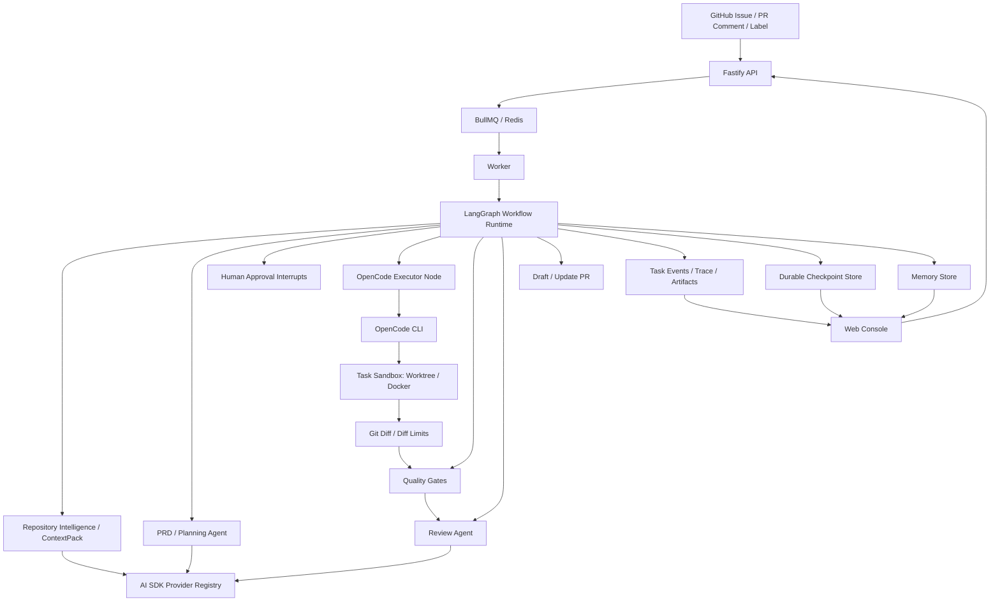
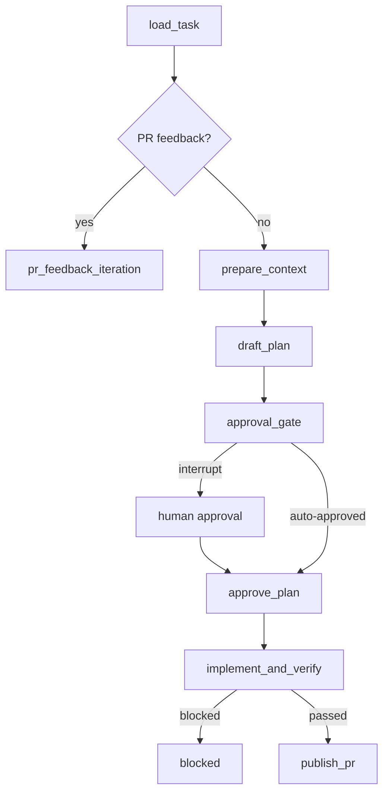

# CodeZero 架构说明

状态：2026-06-04 的现行架构。

## 总览

CodeZero 使用控制平面和执行层分离的设计：

- Fastify API 负责接收 GitHub webhook、控制台操作、配置读写、Memory、Trace、GitHub sync 和知识图接口。
- BullMQ/Redis 负责把 Issue workflow 投递给 worker，API 不直接执行长任务。
- Worker 负责仓库并发控制，并启动或恢复 LangGraph workflow。
- LangGraph 负责任务图、checkpoint、人工审批中断、恢复运行和 PR feedback 迭代。
- AI SDK 是平台 agent 的模型层，处理 PRD、review、context、routing 等结构化调用。
- OpenCode CLI 是默认代码执行层，在沙箱内完成真实代码修改。

CodeZero 自身负责 GitHub 集成、仓库配置、沙箱生命周期、上下文生成、审批、质量门、artifact、dashboard event、memory、trace replay 和 PR 创建。它不重新实现编码 agent。

## 系统形态



## 责任边界

### API 层

API 负责产品入口和短请求：

- GitHub webhook、GitHub sync、手动创建任务、PRD 审批、任务查询。
- Settings Console 配置读写和校验。
- Memory Inbox 的查询、编辑、删除、裁剪。
- Trace Replay、repository onboarding、context files、knowledge graph 接口。
- 创建 task 后写入队列，由 worker 执行长任务。

API 不直接跑实现流程，不直接调用 OpenCode，也不承担 LangGraph 长时间执行。

### Worker 与队列

Worker 负责长任务执行：

- 监听 `issue-workflows` BullMQ 队列。
- 在启动 workflow 前执行仓库级并发控制。
- 对达到并发上限的任务延迟重排队。
- 调用 `createIssueWorkflowGraphRunner(config, tasks).run(taskId)` 启动或恢复 LangGraph。

Redis 是队列运行依赖。Postgres 或文件存储是 task facts，二者职责不同。

### AI SDK 层

AI SDK 是 CodeZero 平台 agent 的模型接口。

它负责：

- provider registry 和模型查找。
- OpenAI-compatible provider 与原生 provider 包。
- PRD、review、routing、classification、context summary 的结构化输出。
- 对超时、限流、网络瞬断和服务端临时错误进行重试。
- 按复杂度选择 provider。

它不负责仓库文件编辑、任意 shell 执行和长时间编码循环。

### LangGraph 层

LangGraph 是任务状态的图运行时。

它负责：

- durable graph execution。
- 以 `task.id` 作为 `thread_id` 写入和恢复 checkpoint。
- PRD 审批中断和恢复。
- 条件边：审批、实现、验证、阻断、发布 PR、PR feedback。
- 把节点运行结果写回 CodeZero task event。

Checkpoint 当前实现：

- 文件存储默认写入 `workflow_graph.checkpoint_file`，默认值为 `data/langgraph-checkpoints.json`。
- Postgres 存储启用时写入 `langgraph_checkpoints` 与 `langgraph_checkpoint_writes`。
- 损坏的 checkpoint 文件会隔离为 `.corrupt-*`，避免进程启动时崩溃。

### OpenCode 执行层

OpenCode 是默认实现 executor。

它负责：

- 在 task sandbox 内读取和编辑源码。
- 运行实现期间需要的本地命令。
- 根据质量门或 review feedback 修复变更。
- 产出最终 working tree diff。
- 流式输出进度，CodeZero 将其转换为 task event。

它不负责 PRD 审批、任务状态流转、PR 创建、memory promotion 和最终质量门裁决。

## 沙箱与隔离

CodeZero 支持两种 sandbox mode。

| 模式       | 实现                                                                                                                 |
| :--------- | :------------------------------------------------------------------------------------------------------------------- |
| `worktree` | 使用 `<sandbox_root>/_git-cache` 镜像仓库缓存，通过 `git worktree add --force -B <branch>` 创建真实 issue 分支工作区 |
| `docker`   | 使用 `docker run` 执行命令，挂载 repo/artifacts/logs 到 `/workspace`，默认关闭网络并应用 Linux container 安全参数    |

Docker 模式默认参数：

- `--network none`，存在网络白名单时切换到 bridge，并在命令 URL 层校验外联 host。
- `--cap-drop ALL`。
- `--security-opt no-new-privileges`。
- `--memory`、`--cpus`、`--pids-limit` 来自 `sandbox.docker`。
- repo、artifact、日志目录分开挂载。

实现完成后会执行 diff 限制：

- `sandbox.limits.max_diff_files`
- `sandbox.limits.max_diff_lines`

超限会阻断后续质量门和 PR 创建。

## Workflow Graph

当前图节点：

```text
load_task
pr_feedback_iteration
prepare_context
draft_plan
approval_gate
approve_plan
implement_and_verify
publish_pr
```

主路径：



LangGraph state 是执行态，CodeZero task repository 是产品事实源。节点需要保持幂等：checkpoint restore 后重新运行节点时，应复用已有 artifact 或只安全替换当前节点范围内的 artifact。

## Trace Replay

Trace Replay API：

```http
GET /tasks/:id/trace/replay?cursor=&limit=
```

返回内容包括：

- replay step 列表。
- 每步的状态、耗时、输入摘要、输出摘要和事件。
- `failedStep`。
- `nextCursor`。
- 可用恢复动作，如 approve PRD、retry workflow、inspect failure、open PR。

该 API 基于 task trace 和 events 生成，不承诺还原模型 token 级输出。

## Memory 系统

Memory Store 支持：

- proposed / approved / rejected 状态。
- `PATCH /memories/:id` 编辑标题、内容、标签、置信度、状态。
- `DELETE /memories/:id` 删除记录。
- `POST /memories/prune` 主动裁剪。
- `max_records`、`max_bytes`、`max_record_bytes` 容量限制。
- 文件损坏时隔离为 `.corrupt-*` 并返回空记录，避免进程崩溃。

Memory promotion 由人工审批控制，agent 只能提出 memory update。

## 非目标

CodeZero 不会：

- 重新实现 OpenCode、Codex、Cline 或其他编码 CLI。
- 让 AI SDK tool call 直接任意写仓库文件。
- 默认合并 PR。
- 未经 review 自动提升 memory 或项目规则。
