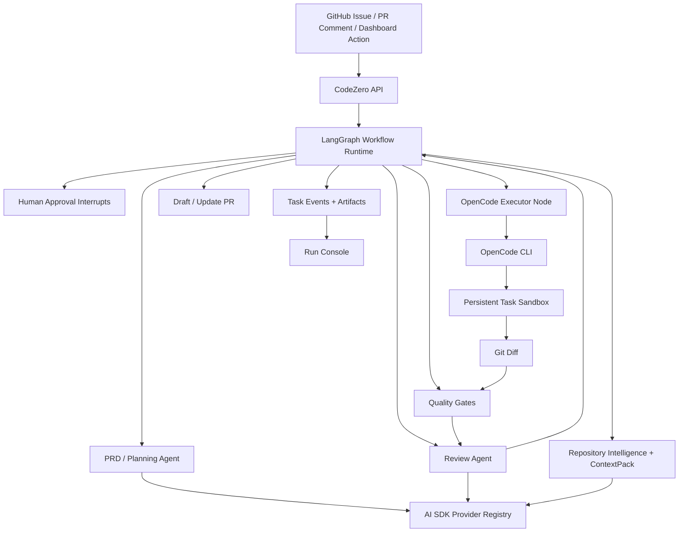
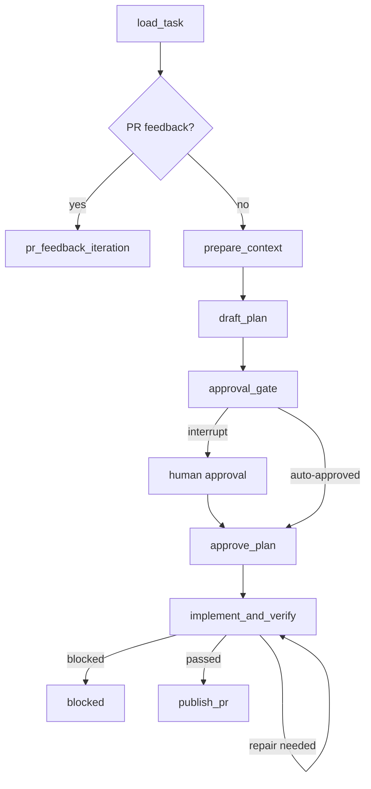

# CodeZero Architecture

Status: canonical architecture as of 2026-05-28.

## Architecture Decision

CodeZero uses three separate runtime layers:

- AI SDK owns model access for CodeZero platform agents.
- LangGraph owns workflow orchestration, checkpointing, callbacks, retries, and human intervention.
- OpenCode owns sandboxed code execution.

CodeZero itself remains the product control plane. It owns GitHub integration, repository configuration, sandbox lifecycle, context generation, approvals, quality gates, artifacts, dashboard events, and PR creation. It does not reimplement a coding agent.

## System Shape



## Responsibility Boundaries

### AI SDK Layer

AI SDK is the single model interface for CodeZero-owned agents.

It handles:

- Provider registry and model lookup.
- OpenAI-compatible providers and native provider packages.
- Structured output for PRD, review, routing, classification, and context summaries.
- Tool calling for controlled platform tools such as repository search, memory retrieval, and codegraph queries.
- Model routing by role, complexity, cost, latency, health, and capability.

It does not handle:

- Repository file editing.
- Arbitrary shell execution.
- Long-running coding loops inside the sandbox.
- PR creation or GitHub side effects without CodeZero policy checks.

Official references:

- AI SDK providers: https://ai-sdk.dev/docs/providers
- AI SDK provider registry: https://ai-sdk.dev/docs/reference/ai-sdk-core/provider-registry
- AI SDK structured output: https://ai-sdk.dev/docs/ai-sdk-core/generating-structured-data
- AI SDK tool calling: https://ai-sdk.dev/docs/ai-sdk-core/tools-and-tool-calling

### LangGraph Layer

LangGraph is the workflow runtime for task state.

It handles:

- Durable graph execution.
- Checkpoints and resume by `task.id` / `thread_id`.
- Human approval interrupts.
- Conditional edges for approval, repair, block, retry, PR update, and completion.
- Streaming callbacks into CodeZero task events.
- Parallel branches for repository intelligence, memory retrieval, and policy checks.
- Replay and time-travel debugging for failed runs.

It does not handle:

- Low-level provider configuration directly.
- Coding-agent file editing.
- CodeZero persistence schema ownership.

Official references:

- LangGraph overview: https://docs.langchain.com/oss/javascript/langgraph/overview
- LangGraph persistence: https://docs.langchain.com/oss/javascript/langgraph/persistence
- LangGraph interrupts: https://docs.langchain.com/oss/javascript/langgraph/human-in-the-loop

### OpenCode Execution Layer

OpenCode is the only default implementation executor.

It handles:

- Reading source files in the task sandbox.
- Editing files.
- Running local commands during implementation.
- Repairing implementation failures when prompted with quality gate or review feedback.
- Producing a final working tree diff.
- Streaming progress that CodeZero records as task events.

It does not handle:

- PRD approval.
- Task state transitions.
- PR creation.
- Memory promotion.
- Repository policy decisions.
- Final quality gate authority.

OpenCode uses AI SDK and Models.dev for provider support, so CodeZero's single provider configuration can generate both AI SDK registry entries and OpenCode config artifacts. Official reference: https://opencode.ai/docs/providers

## Single Provider Configuration

There is one active user-facing provider config. Settings Console updates `providers.default`, saves the selected API key env var, and CodeZero compiles that single provider into two runtime views:

- AI SDK registry for platform agents.
- OpenCode config for sandbox implementation.

Supported provider types are:

- `openai-compatible`: OpenAI, DeepSeek, Qwen compatible mode, Xiaomi MiMo, OpenRouter, and any compatible gateway.
- `anthropic`: Claude through `@ai-sdk/anthropic`.
- `google`: Gemini through `@ai-sdk/google`.
- `xai`: Grok through `@ai-sdk/xai`.
- `mistral`: Mistral through `@ai-sdk/mistral`.
- `groq`: Groq through `@ai-sdk/groq`.

Example:

```yaml
providers:
  default:
    type: openai-compatible
    base_url: "${OPENAI_BASE_URL}"
    api_key_env: "OPENAI_API_KEY"
    model: "${OPENAI_MODEL}"
    supports_tools: true
    supports_structured_output: true
    coding_executor:
      mode: auto
```

Native provider example:

```yaml
providers:
  default:
    type: anthropic
    api_key_env: "ANTHROPIC_API_KEY"
    model: "claude-sonnet-4-5"
    supports_tools: true
    supports_structured_output: true
    coding_executor:
      mode: auto

agents:
  prd:
    provider: default
    system_prompt: prompts/system/prd-agent.md
  implementation:
    provider: default
    system_prompt: prompts/system/main-agent.md
  review:
    provider: default
    system_prompt: prompts/system/review-agent.md
```

The same config must not be copied into unrelated files. API keys stay in environment variables. Generated OpenCode config may reference keys through environment placeholders, but must not store raw secrets.

## Workflow Graph

The current graph nodes are:

```text
load_task
pr_feedback_iteration
prepare_context
draft_plan
approval_gate
approve_plan
implement_and_verify
publish_pr
```

Primary edges:



## Graph State Contract

LangGraph state is the execution state, but CodeZero persistence remains the product source of truth.

Required state fields:

- `taskId`
- `issue`
- `repository`
- `sandbox`
- `contextPack`
- `planningDocument`
- `humanApproval`
- `executorRuns`
- `qualityGateResults`
- `reviewResult`
- `pr`
- `feedback`
- `events`
- `artifacts`
- `repairBudget`
- `blockReason`

Every node must be idempotent against this state. Re-running a node after checkpoint restore must either reuse existing artifacts or safely replace node-scoped artifacts.

## Human Intervention

Human intervention is represented as LangGraph interrupts plus CodeZero events.

Interrupts are used for:

- PRD approval.
- Policy approval for high-risk changes.
- Manual retry / cancel / unblock.
- PR feedback that should resume the same task branch.

Dashboard and GitHub comments both resume the same graph thread. They must not create duplicate tasks, duplicate branches, or feedback-specific sandboxes.

## OpenCode Executor Contract

`run_opencode_executor` receives:

- task metadata
- approved planning document
- ContextPack
- selected file snippets
- previous quality gate output
- review feedback
- model/provider config compiled for OpenCode
- sandbox path
- artifact path

It returns:

- exit code
- stdout/stderr log artifact
- structured progress events
- final `git diff`
- changed file list

If OpenCode exits non-zero or produces no diff, the node restores the pre-run checkpoint and records executor diagnostics. CodeZero does not fall back to JSON patch, file replacement, or self-built editing actions.

## Tool Gateway Role

Tool Gateway remains useful, but only for CodeZero-controlled tools:

- repository search
- file read
- codegraph query
- memory search
- policy checks
- allowlisted shell checks
- future high-risk approval surfaces

Tool Gateway is not the implementation editing loop. Repository writes during implementation are delegated to OpenCode inside the sandbox.

## Quality Gates

CodeZero is the final authority for quality.

Required checks before PR creation or update:

- setup command when configured
- unit tests
- typecheck
- lint
- build
- frontend screenshots when configured
- review agent approval
- PR body completeness
- policy checks

Failures feed back into `run_opencode_executor` when repairable. Environmental failures block with an explicit reason.

## Non-Goals

CodeZero will not:

- reimplement OpenCode, Codex, Cline, or another coding CLI
- expose OpenCode as the user-facing product identity
- let AI SDK tool calls directly write arbitrary repository files
- silently bypass human approval when policy requires it
- merge PRs by default
- promote memory or project rules without review
