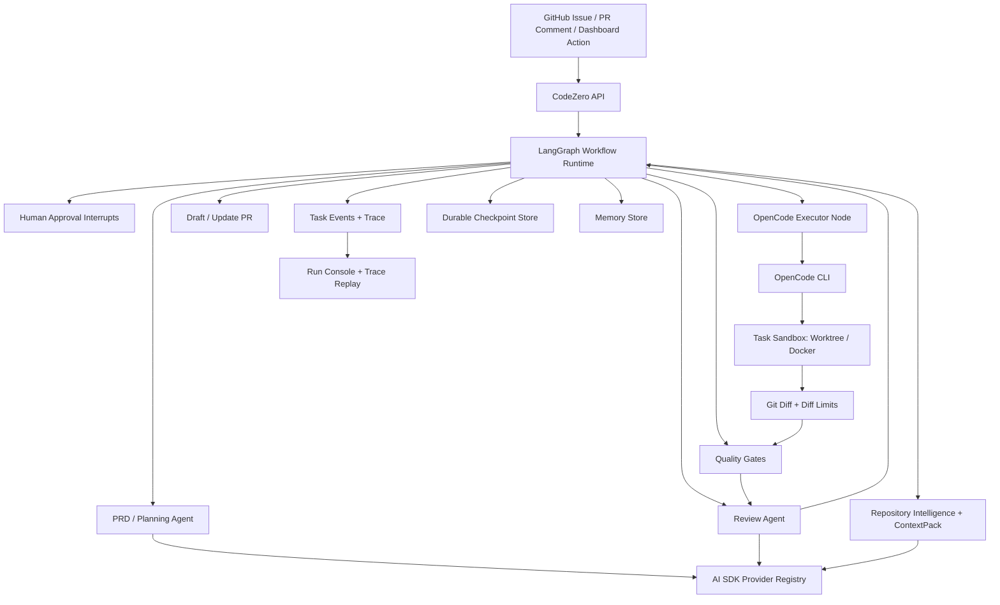
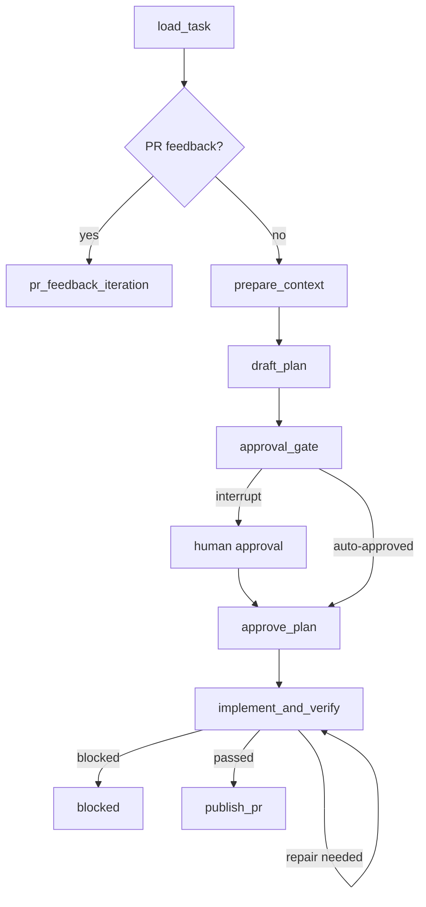

# CodeZero 架构说明

状态：2026-06-03 的现行架构。

## 架构决策

CodeZero 使用三层运行时：

- AI SDK 负责 CodeZero 平台 agent 的模型访问、provider 路由和瞬时失败重试。
- LangGraph 负责任务图编排、持久 checkpoint、人工审批中断和恢复。
- OpenCode 负责在沙箱内执行真实代码修改。

CodeZero 自身是控制平面，负责 GitHub 集成、仓库配置、沙箱生命周期、上下文生成、审批、质量门禁、artifact、dashboard event、memory、trace replay 和 PR 创建。它不重新实现编码 agent。

## 系统形态



## 责任边界

### AI SDK 层

AI SDK 是 CodeZero 平台 agent 的唯一模型接口。

它负责：

- provider registry 和模型查找。
- OpenAI-compatible provider 与原生 provider 包。
- PRD、review、routing、classification、context summary 的结构化输出。
- 对超时、限流、网络瞬断和服务端临时错误进行重试。
- 按复杂度选择 provider。

它不负责：

- 仓库文件编辑。
- 任意 shell 执行。
- 长时间编码循环。
- 绕过 CodeZero policy 的 GitHub 副作用。

### LangGraph 层

LangGraph 是任务状态的图运行时。

它负责：

- durable graph execution。
- 以 `task.id` 作为 `thread_id` 写入和恢复 checkpoint。
- PRD 审批、人工 retry、cancel、unblock 等中断与恢复。
- 条件边：审批、修复、阻断、重试、PR 更新、完成。
- 把节点事件流式写回 CodeZero task event。

Checkpoint 当前实现：

- 文件存储默认写入 `workflow_graph.checkpoint_file`，默认值为 `data/langgraph-checkpoints.json`。
- Postgres 存储启用时写入 `langgraph_checkpoints` 与 `langgraph_checkpoint_writes`。
- 损坏的 checkpoint 文件会隔离为 `.corrupt-*`，避免进程启动时崩溃。

### OpenCode 执行层

OpenCode 是默认实现 executor。

它负责：

- 在 task sandbox 内读取、编辑源码。
- 运行实现期间需要的本地命令。
- 根据质量门禁或 review feedback 修复变更。
- 产出最终 working tree diff。
- 流式输出进度，CodeZero 将其转换为 task event。

它不负责：

- PRD 审批。
- 任务状态流转。
- PR 创建。
- memory promotion。
- 仓库 policy 决策。
- 最终质量门禁裁决。

## 沙箱与隔离

CodeZero 支持两种 sandbox mode。

| 模式 | 实现 |
|:---|:---|
| `worktree` | 使用 `<sandbox_root>/_git-cache` 镜像仓库缓存，通过 `git worktree add --force -B <branch>` 创建真实 issue 分支工作区 |
| `docker` | 使用 `docker run` 执行命令，挂载 repo/artifacts/logs 到 `/workspace`，默认关闭网络并应用 Linux container 安全参数 |

Docker 模式默认参数：

- `--network none`，存在网络白名单时切换到 bridge，并在命令 URL 层校验外联 host。
- `--cap-drop ALL`。
- `--security-opt no-new-privileges`。
- `--memory`、`--cpus`、`--pids-limit` 来自 `sandbox.docker`。
- repo 只挂载到 `/workspace/repo`，artifact 和日志分开挂载。

实现完成后会执行 diff 限制：

- `sandbox.limits.max_diff_files`
- `sandbox.limits.max_diff_lines`

超限会阻断后续质量门禁和 PR 创建。

## Workflow Graph

当前图节点：

```text
load_task
pr_feedback_iteration
prepare_context
draft_plan
approval_gate
approve_plan
implement_and_verify
publish_pr
```

主路径：



LangGraph state 是执行态，CodeZero task repository 是产品事实源。节点必须幂等：checkpoint restore 后重新运行节点时，应该复用已有 artifact 或安全替换节点范围内的 artifact。

## Trace Replay

Trace Replay API 已落地：

```http
GET /tasks/:id/trace/replay?cursor=&limit=
```

返回内容包括：

- replay step 列表。
- 每步的状态、耗时、输入摘要、输出摘要和事件。
- `failedStep`。
- `nextCursor`。
- 可用恢复动作，如 approve PRD、retry workflow、inspect failure、open PR。

该 API 基于 task trace 和 events 生成，不承诺还原模型 token 级输出。

## Memory 系统

Memory Store 支持：

- proposed / approved / rejected 状态。
- `PATCH /memories/:id` 编辑标题、内容、标签、置信度、状态。
- `DELETE /memories/:id` 删除记录。
- `POST /memories/prune` 主动裁剪。
- `max_records`、`max_bytes`、`max_record_bytes` 容量限制。
- 文件损坏时隔离为 `.corrupt-*` 并返回空记录，避免进程崩溃。

Memory promotion 仍由人工审批控制，agent 只能提出 memory update。

## Agent 能力审计

默认配置覆盖以下能力：

| 能力 | agent / skill | 状态 |
|:---|:---|:---|
| 需求澄清与 PRD | `prd` + `brainstorm-requirements` + `draft-prd` | 已配置 |
| 代码搜索规划 | `search_planner` + `agentic-code-search` | 已配置 |
| 实现范围规划 | `implementation` + `repo-context-compress` + `implementation-scope-planner` | 已配置 |
| 代码实现 | OpenCode executor | 已配置 |
| PR 合规 Review | `review` + `pr-compliance-review` | 已配置 |
| 前端验证 | `review` + `frontend-verification` + screenshot quality gate | 已配置 |
| 后端验证 | `review` + `backend-verification` + test/typecheck/build quality gate | 已配置 |
| PR 正文 | deterministic PR local verification builder | 已配置 |

`AgentDefinition.skillRefs` 会在 agent factory 中解析为 platform skill 内容并注入 system prompt。配置中声明 skill 但不注入 prompt 的问题已经修复。

## 稳定性约束

- Postgres task repository 的 DDL migration 每个 repository 实例只执行一次。
- Postgres LangGraph checkpoint migration 每个 saver 实例只执行一次。
- 文件 task store、memory store、checkpoint store 的 JSON parse 都有损坏文件隔离。
- 模型 provider 支持 `max_retries`，默认值为 2。
- OpenCode 执行失败或无 diff 时会恢复 implementation checkpoint，避免失败尝试污染下一轮。

## 非目标

CodeZero 不会：

- 重新实现 OpenCode、Codex、Cline 或其他编码 CLI。
- 让 AI SDK tool call 直接任意写仓库文件。
- 在 policy 要求人审时静默绕过审批。
- 默认合并 PR。
- 未经 review 自动提升 memory 或项目规则。
