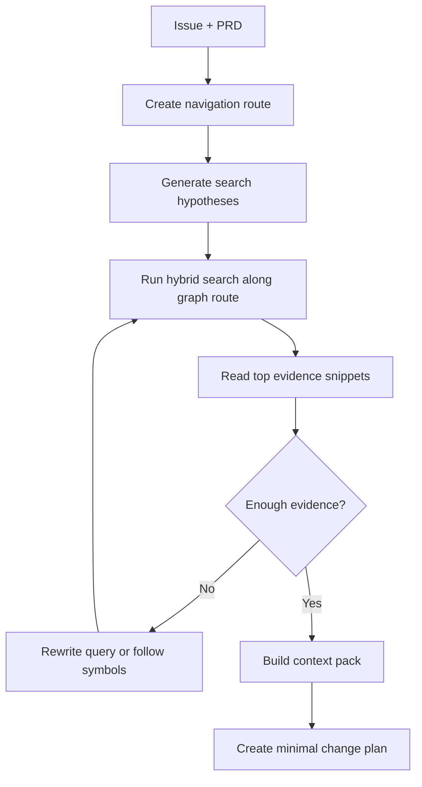

# 大仓库理解、Agentic Search 与自进化项目地图

## 1. 核心原则

沙箱 clone 完整仓库是为了隔离、可复现和最终执行测试，不代表 Agent 要阅读完整仓库。

对于大仓库，系统必须采用：

- 全仓库索引。
- Repo Navigation Graph。
- 小上下文推理。
- 多轮 agentic search。
- 项目业务 skill 持续维护。
- 受控记忆检索：只把与当前任务相关、带来源和置信度的 memory 注入 ContextPack。
- 证据驱动的文件选择。
- 最小修改计划。

一句话：Agent 应该像资深工程师一样先定位，再精读，再修改，而不是把仓库从头读到尾。

## 2. Codebase Intelligence 架构

建议新增 `codebase-intelligence` 模块，负责把大仓库转成可搜索、可压缩、可演进的项目知识层。

```text
packages/
  codebase-intelligence/
    src/
      indexer/
      search/
      navigation-graph/
      symbol-graph/
      business-map/
      memory/
      evidence/
      project-map-updater/
```

## 3. 分层索引

### 3.1 文件路径索引

记录文件路径、文件类型、所属模块、大小、最近修改时间、是否测试文件、是否生成文件、是否可忽略。

用途：

- 快速排除 `dist`、`build`、锁文件、快照、生成代码。
- 根据路径关键词定位模块。

### 3.2 符号索引

对 TypeScript、JavaScript、Python、Go 等主流语言建立符号索引。

记录：

- class / function / component / hook / route / API handler。
- export / import。
- 调用关系。
- 定义位置。
- 引用位置。

用途：

- 从 Issue 中的业务词定位可能的入口。
- 从入口追踪到 service、model、测试。
- 避免只靠关键词搜索。

### 3.3 语义向量索引

对文件摘要、函数摘要、业务文档、PRD、历史 Issue / PR 摘要和 `.agent` 项目 skill 建立 embedding。

用途：

- 支持自然语言需求检索。
- 找到名称不匹配但语义相关的模块。

### 3.4 历史变更索引

记录历史 PR / commit 的改动摘要、touched files、Issue 链接、测试命令和 Review 结论。

用途：

- 找相似需求。
- 学习项目惯例。
- 判断哪些文件通常一起修改。

## 4. Agentic Search 流程

Agentic search 不是一次检索，而是一个循环：



每轮检索组合：

- keyword search：`rg`。
- path search：文件路径和模块名。
- symbol search：定义和引用。
- graph search：从入口沿 route、import、call、test、ownership 边导航。
- semantic search：embedding。
- history search：相似 PR / Issue。
- business skill search：项目业务文档。

## 5. 证据评分

每个候选文件必须带证据分：

- 与 PRD 关键词匹配。
- 与业务 skill 匹配。
- 被相关入口引用。
- 有对应测试。
- 历史相似 PR 修改过。
- 文件大小适合精读。

只有高分文件进入精读上下文。

## 6. Context Pack

实现 Agent 不直接拿“仓库摘要”，而是拿一个小而硬的 `ContextPack`。

```json
{
  "task_summary": "string",
  "business_rules": [],
  "relevant_files": [
    {
      "path": "src/billing/refund.ts",
      "reason": "Matches refund business rule and used by refund API route",
      "evidence": [],
      "read_mode": "full | excerpt | summary"
    }
  ],
  "symbols": [],
  "tests": [],
  "similar_changes": [],
  "non_relevant_areas": [],
  "open_questions": []
}
```

`ContextPack` 必须比原始仓库小几个数量级，只包含当前任务证据链。

如果命中长期记忆，ContextPack 还应包含经过筛选的 memory 摘要：

```json
{
  "memories": [
    {
      "id": "mem_123",
      "kind": "episodic",
      "title": "Similar refund status PR",
      "content": "Prior run touched order detail and refund tests.",
      "score": 0.91,
      "confidence": 0.82,
      "reasons": ["matched refund"],
      "sourceTaskId": "task-acme-shop-128"
    }
  ]
}
```

Memory 只作为证据链的一部分，不能覆盖当前代码、PRD、测试结果和人工审批。完整策略见 [MEMORY_ARCHITECTURE.md](MEMORY_ARCHITECTURE.md)。

## 7. 自进化项目地图

系统应维护一个可审计的项目地图，而不是每次从零理解。

建议文件：

```text
.agent/
  project-map.json
  module-map.md
  business-glossary.md
  route-map.md
  ownership.md
  testing-guide.md
  change-patterns.md
```

每次 PR 成功后，Agent 可以提出项目地图更新建议：

- 新增模块说明。
- 新增业务术语。
- 新增常用测试命令。
- 新增路由和页面映射。
- 记录某类需求通常修改哪些文件。

项目地图属于长期记忆，不能静默修改。默认由 Agent 生成 `project-map-update.md`，Review subagent 审核后放进 PR，由人决定是否合并。

## 8. 业务 Skill 如何参与检索

项目业务 skill 不只是 prompt 文本，也应成为检索索引。

例如：

- Issue 提到“退款失败”。
- 业务 skill 中定义“退款必须经过 billing service 和 ledger reconciliation”。
- Search Agent 根据该规则扩展 query：`refund`、`billing`、`ledger`、`reconciliation`、`payment adjustment`。

这样 Agent 能读懂业务词背后的代码路径。

## 9. 多 Agent 分工

- Search Planner Agent：生成搜索假设和查询计划。
- Explorer Agent：执行检索、读取片段、追踪符号和输出证据。
- Context Curator Agent：把检索结果压缩成 `ContextPack`。
- Implementation Agent：只基于 PRD、业务 skill、ContextPack 和最小修改计划工作。
- Review Agent：检查实际 diff 是否超出 ContextPack 和修改计划所支持的范围。

## 10. 避免上下文爆炸的规则

- 不把完整目录树长期放进上下文，只放摘要。
- 不读取大文件全文，先摘要后按需片段读取。
- 不一次性读取超过 N 个候选文件。
- 不把测试日志全文放入模型，只保留失败片段。
- 不把历史 PR 全文放入模型，只保留摘要和 touched files。
- 每轮检索都要说明“为什么还需要更多上下文”。
- 找到足够证据后必须停止检索，进入计划阶段。

## 11. 推荐检索预算

默认：

- 搜索轮数：最多 4 轮。
- 精读文件：最多 8 个。
- 摘要文件：最多 20 个。
- 相似 PR：最多 5 个。
- 单个大文件 excerpt：最多 200 行。
- ContextPack：最多 30k tokens。

复杂任务可以提高预算，但超过阈值必须人工审核 PRD 或拆分任务。

## 12. PR 前一致性检查

Review subagent 必须检查：

- diff 中每个文件是否在最小修改计划中。
- 如果不在，是否有明确理由。
- 是否存在未被业务 skill 或 PRD 支持的改动。
- 是否修改了检索阶段标记为非相关区域的文件。
- 是否遗漏了 ContextPack 中指出的测试。

## 13. Repo Navigation Graph

Repo Navigation Graph 是 codebase intelligence 的核心索引之一。

它把仓库变成一张可导航的图：

- 文件和目录。
- 符号、组件、函数、hook、route、API handler。
- import/export、调用链、组件渲染关系。
- 源文件到测试文件。
- 页面 URL、API endpoint、worker、migration。
- 业务术语到模块。
- CODEOWNERS 和高风险目录。
- 历史 PR changed-with 关系。
- memory 到模块或符号的链接。

Agentic search 应先生成 `navigation-route.json`，再按路线读取上下文。这样能减少无关读取，提升目标文件命中率，并让 Review subagent 能解释 diff 是否越界。

详细设计见 [REPO_NAVIGATION_GRAPH.md](REPO_NAVIGATION_GRAPH.md)。
