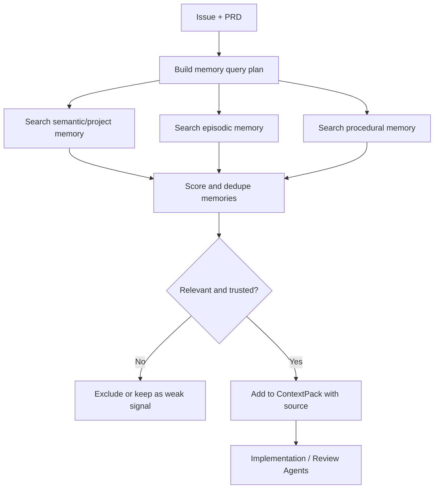

# Agent 记忆管理架构

## 1. 目标

本项目的记忆系统不是为了让 Agent “什么都记住”，而是为了让它在不同仓库、不同 Issue、不同运行轮次之间复用可靠经验，同时保持可审计和可回滚。

记忆系统要解决四个问题：

- 少走弯路：复用历史 Issue、PR、失败日志、人工反馈中的经验。
- 懂项目：沉淀业务术语、模块映射、测试入口、代码惯例。
- 可恢复：长任务中断后能从明确状态继续，而不是重新猜。
- 可治理：记忆有来源、置信度、过期策略和人工审核边界。

## 2. 记忆分层

### 2.1 L0：Workflow Memory

这是系统的事实来源，不能被向量检索或模型摘要替代。

内容：

- task status。
- event log。
- artifact。
- PRD 审批记录。
- sandbox 信息。
- base commit、branch、PR URL。
- command list 和 quality gate result。
- Review subagent 结论。

存储：

- MVP：file store 或 Postgres。
- 生产：Postgres + append-only event log。

用途：

- durable workflow 恢复。
- 看板展示。
- 审计和回放。
- PR 描述生成。

### 2.2 L1：Session Memory

Session memory 是单个 Agent run 或修复循环中的短期记忆。

内容：

- 当前 run 的对话历史。
- 上一次 diff apply 错误。
- 上一轮测试失败摘要。
- 当前计划和已尝试修复。

边界：

- 默认只在当前 task 内有效。
- 可以压缩成 run summary，但不能自动变成长期项目规则。

用途：

- 避免修复循环反复尝试同一个无效方案。
- 支持 human-in-the-loop 后继续执行。
- 支持 Agent handoff 时保留必要上下文。

### 2.3 L2：Semantic Project Memory

Semantic project memory 表示“这个项目是什么样的”。

内容：

- `.agent/project.md`
- `.agent/module-map.md`
- `.agent/business-glossary.md`
- `.agent/route-map.md`
- `.agent/ownership.md`
- `.agent/testing-guide.md`
- `.agent/change-patterns.md`

用途：

- 把业务语言扩展成代码搜索 query。
- 帮助 ContextPack 选择相关模块。
- 让 Review subagent 判断 diff 是否符合项目惯例。

治理：

- Agent 只能提出更新建议，例如 `project-map-update.md`。
- 默认由人通过 PR 合并后才成为可信长期记忆。
- 每条规则应保留来源 PR 或人工说明。

### 2.4 L3：Episodic Memory

Episodic memory 表示“过去发生过什么”。

内容：

- 历史 Issue/PR 摘要。
- touched files。
- 相关测试命令。
- 失败门禁和修复过程。
- 人工 Review 反馈。
- 最终是否合并。

用途：

- 查找相似需求。
- 识别常见失败模式。
- 判断某类需求通常改哪些文件。
- 为 PRD complexity scoring 提供历史依据。

示例：

```json
{
  "kind": "episodic",
  "repo": "acme/shop",
  "source": "pull_request#128",
  "summary": "Refund status copy changes usually touch order-detail page and refund-service tests.",
  "touchedFiles": [
    "src/orders/order-detail.tsx",
    "src/billing/refund-service.test.ts"
  ],
  "verification": [
    "pnpm test src/billing/refund-service.test.ts",
    "pnpm test src/orders/order-detail.test.tsx"
  ],
  "outcome": "merged",
  "confidence": 0.82
}
```

### 2.5 L4：Procedural Memory

Procedural memory 表示“应该怎么做”。

内容：

- 某类任务的标准处理流程。
- 项目特定验证步骤。
- 常见故障修复 playbook。
- prompt/skill 的改进建议。

用途：

- 让 Agent 复用成功流程。
- 让不同 subagent 共享执行规范。
- 让项目越用越稳定，而不是每次从零摸索。

示例：

```markdown
## Frontend copy change playbook

1. Locate route through `.agent/route-map.md`.
2. Search component text and i18n keys.
3. Update matching unit test or snapshot only if behavior changed.
4. Run component test and desktop/mobile screenshot gate.
5. Do not rewrite surrounding layout unless PRD requests it.
```

### 2.6 L5：Human Preference And Policy Memory

内容：

- 团队偏好的 PR 粒度。
- 禁止自动修改的目录。
- 需要强制人审的领域。
- Review 风格偏好。
- 仓库 owner 的验证偏好。

治理：

- 默认需要人工录入或人工确认。
- 不从单次模型推断直接生成。
- 高优先级，冲突时覆盖普通 memory。

## 3. Memory Record 数据模型

建议抽象：

```ts
type AgentMemoryRecord = {
  id: string;
  scope: "org" | "repo" | "agent" | "task";
  repo?: string;
  agentRole?: string;
  kind: "semantic" | "episodic" | "procedural" | "policy";
  title: string;
  content: string;
  sourceType: "human" | "task" | "pull_request" | "project_map" | "skill";
  sourceRef: string;
  confidence: number;
  reviewedByHuman: boolean;
  validFrom: string;
  expiresAt?: string;
  embeddingRef?: string;
  tags: string[];
  createdAt: string;
  updatedAt: string;
};
```

建议关系：

```text
tasks
  -> task_events
  -> artifacts
  -> agent_runs
  -> memory_records
  -> memory_links
  -> memory_embeddings
```

`memory_links` 用来表达：

- memory 来自哪个 task。
- memory 被哪个 ContextPack 使用过。
- memory 是否被后续 PR 证明过期。

## 4. 读取流程

记忆读取必须走 progressive disclosure，不应把所有 memory 塞进模型。



注入 ContextPack 时必须带：

- memory id。
- 来源。
- 创建时间。
- 是否人工确认。
- confidence。
- 为什么与当前任务相关。

## 5. 写入流程

长期记忆不能由实现 Agent 静默写入。

推荐流程：

1. 任务结束后生成 `run-summary.json`。
2. Memory extractor 从 run summary、diff、测试、Review 结论中提取候选记忆。
3. 生成 `memory-update.md` 或 `project-map-update.md` artifact。
4. Review subagent 检查候选记忆是否过度泛化、是否包含敏感信息、是否有来源。
5. 人在 PR 中审核并合并。
6. 合并后索引器把新记忆写入 memory store。

可以自动写入的内容只限：

- task 内 session summary。
- 临时失败摘要。
- 已有事实产物的索引元数据。

## 6. 过期与冲突处理

记忆可能过期，所以必须有冲突处理策略：

- 如果 memory 与当前代码冲突，以当前 base branch 代码为准。
- 如果 memory 与 PRD 冲突，以 PRD 和人工审批为准。
- 如果两条 memory 冲突，优先使用人工确认、较新、置信度更高、来源更具体的一条。
- 如果 Agent 发现 memory 过期，生成 `memory-deprecation` 建议，不直接删除。

## 7. 安全规则

禁止写入长期记忆：

- API key、token、密码、私钥。
- 用户隐私数据。
- 生产日志中的原始个人信息。
- 未公开的客户名称或合同条款，除非仓库策略允许。
- 模型隐藏推理过程。

所有 memory artifact 都要经过 secret scan。

## 8. 与 ContextPack 的关系

Memory 不是 ContextPack 的替代品。

ContextPack 面向当前任务，回答：

- 这次要改什么？
- 证据是什么？
- 该读哪些文件？
- 该跑哪些测试？

Memory 面向跨任务经验，回答：

- 过去类似任务怎么做？
- 这个仓库有什么惯例？
- 哪些路径经常一起改？
- 哪些失败模式要避免？

最终实现 Agent 只接收经过筛选的 memory 摘要，不直接访问整个 memory store。

## 9. 与 Skill 的关系

Skill 是稳定程序化知识，memory 是运行中积累的经验。

推荐升级路径：

1. 单次经验进入 episodic memory。
2. 多次重复出现后变成 procedural memory proposal。
3. 人审后沉淀为项目 skill 或 `.agent/change-patterns.md`。
4. 平台通用经验再提升为平台 skill。

这样能展示“自进化”，又不会让 Agent 自己随意改规则。

## 10. MVP 到 P1 实施步骤

### Step 1：记录 run summary

每个 task 完成后生成：

```json
{
  "taskId": "task-acme-shop-42",
  "issue": "https://github.com/acme/shop/issues/42",
  "prdSummary": "...",
  "changedFiles": [],
  "commandsRun": [],
  "qualityGateFailures": [],
  "reviewFindings": [],
  "prUrl": "..."
}
```

### Step 2：生成 memory proposal artifact

Artifact 类型：

- `memory-proposal`
- `memory-update`
- `project-map-update`
- `skill-update-suggestion`

当前基础实现：

- `@agent/memory` 提供 `FileMemoryStore`、`createTaskMemoryProposal` 和相似 Issue 检索排序。
- workflow 创建 draft PR 后会生成 `memory-proposal.json` artifact。
- proposal 默认包含 episodic memory 和 procedural verification memory。
- `FileMemoryStore.search` 只返回 `approved` memory，避免未审核记忆污染后续 ContextPack。
- workflow 构建 ContextPack 时会生成 `memory-context.json` artifact，并记录 `MEMORY_RETRIEVED` 事件。
- API 暴露 `GET /memories`、`POST /memories/:id/approve` 和 `POST /memories/:id/reject`，用于人工审核 proposed memory。

### Step 3：ContextPack 检索 memory

`ContextPack` 增加：

```json
{
  "memories": [
    {
      "id": "mem_123",
      "kind": "episodic",
      "title": "Similar refund status PR",
      "content": "Prior run touched refund status flow.",
      "score": 0.91,
      "confidence": 0.82,
      "reasons": ["matched refund"],
      "sourceTaskId": "task-acme-shop-128"
    }
  ]
}
```

### Step 4：Review subagent 审核 memory 使用

Review subagent 额外检查：

- diff 是否过度依赖未确认 memory。
- memory 是否与当前代码冲突。
- 是否应生成 project map 更新。
- 是否暴露敏感信息。

## 11. 成功指标

- 相似 Issue 的 context search 轮数下降。
- 质量门禁首次通过率提升。
- 人工 Review 指出“不了解项目惯例”的问题减少。
- Agent 生成 PR 的平均耗时下降。
- 记忆命中后仍能保持最小修改，不引入无关改动。
- 被人工接受的 memory proposal 比例提升。
