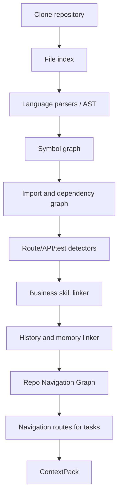

# Repo Navigation Graph

## 1. 为什么需要代码导航图

需要，而且应该作为核心能力加入。

大仓库里，Agent 最大的问题通常不是“不会写代码”，而是：

- 不知道入口在哪里。
- 只靠关键词搜索命中错误模块。
- 读了太多无关文件。
- 找不到应该一起改的测试。
- 不知道某个 UI、API、service、model、schema 之间的关系。
- Review 时无法解释为什么 diff 只改这些文件。

Repo Navigation Graph 的目标是给 Agent 一张仓库地图，让它像资深工程师一样先定位、再精读、再修改。

## 2. 定义

Repo Navigation Graph 是一个多层图：

- 文件图：目录、文件类型、生成文件、测试文件、入口文件。
- 符号图：function、class、component、hook、route、API handler、schema、model。
- 依赖图：import/export、package dependency、workspace dependency。
- 调用图：函数调用、组件引用、service 调用、route 到 handler。
- 测试图：源文件到测试文件、测试命令、fixture、snapshot。
- 运行图：页面 URL、API endpoint、CLI command、job worker、migration。
- 业务图：业务术语到模块、project skill 到代码区域。
- 记忆图：历史 PR、人工反馈、失败经验挂到模块或符号。
- Ownership 图：CODEOWNERS、目录 owner、风险区域。

## 3. 图模型

### 3.1 Node

```ts
type RepoGraphNode =
  | FileNode
  | SymbolNode
  | RouteNode
  | ApiEndpointNode
  | TestNode
  | PackageNode
  | BusinessConceptNode
  | MemoryNode
  | OwnerNode;
```

示例：

```json
{
  "id": "symbol:src/orders/order-detail.tsx#OrderDetail",
  "kind": "component",
  "name": "OrderDetail",
  "path": "src/orders/order-detail.tsx",
  "range": {
    "start": 12,
    "end": 160
  },
  "summary": "Order detail page component that renders refund status and order timeline.",
  "tags": ["frontend", "orders", "refund"]
}
```

### 3.2 Edge

```ts
type RepoGraphEdgeKind =
  | "imports"
  | "exports"
  | "calls"
  | "renders"
  | "handles_route"
  | "tests"
  | "configured_by"
  | "owns"
  | "mentions_business_concept"
  | "changed_with"
  | "verified_by"
  | "depends_on";
```

示例：

```json
{
  "from": "file:src/orders/order-detail.tsx",
  "to": "file:src/orders/order-detail.test.tsx",
  "kind": "tests",
  "confidence": 0.91,
  "evidence": ["same basename", "imports OrderDetail"]
}
```

## 4. Agent 如何使用导航图

### 4.1 搜索前：生成导航路线

输入 Issue：

```text
Refund status copy is wrong on order detail page.
```

导航图生成：

```json
{
  "entrypoints": [
    {
      "node": "route:/orders/:id",
      "reason": "Issue mentions order detail page"
    }
  ],
  "candidatePaths": [
    "src/orders/order-detail.tsx",
    "src/orders/order-detail.test.tsx",
    "src/billing/refund-status.ts"
  ],
  "followEdges": ["handles_route", "renders", "imports", "tests"],
  "stopWhen": "Found UI text source and matching test"
}
```

### 4.2 ContextPack 前：选精读文件

ContextPack 不再只依赖 keyword score，而是结合：

- graph distance from entrypoint。
- test edge。
- business concept edge。
- changed-with history。
- owner/risk edge。
- file size and generated status。

### 4.3 实现前：写入 PRD/Plan 实现范围

导航图帮助判断：

- 哪些文件必须读。
- 哪些测试必须改或跑。
- 哪些相邻模块不应该动。
- 是否触碰高风险 owner。

### 4.4 Review 前：检查 scope

Review subagent 用导航图检查：

- diff 文件是否在 planned navigation route 内。
- 新增文件是否有合理 edge。
- 是否遗漏相关测试。
- 是否改了图中标记为高风险或 unrelated 的模块。

## 5. 构建流程



## 6. 数据来源

| 来源              | 用途                                                  |
| ----------------- | ----------------------------------------------------- |
| file system       | 文件节点、目录、生成文件识别                          |
| AST/parser        | 符号、import/export、调用、组件引用                   |
| package files     | workspace dependency、scripts、framework detection    |
| route conventions | Next.js routes、Express/Fastify routes、API endpoints |
| test conventions  | source-to-test mapping、test command suggestion       |
| `.agent/*`        | 业务术语、模块说明、测试指南、ownership               |
| git history       | changed-with edge、相似 PR、热点文件                  |
| CODEOWNERS        | ownership 和风险区域                                  |
| memory store      | 历史经验和失败模式                                    |

## 7. 导航图产物

建议产物：

```text
artifacts/{task_id}/repo-navigation-graph.json
artifacts/{task_id}/navigation-route.json
.agent/repo-navigation-summary.md
```

`repo-navigation-graph.json` 可以较大，供系统检索使用。

`navigation-route.json` 必须小而清晰，供 Agent 当前任务使用：

```json
{
  "taskId": "task-acme-shop-42",
  "entrypoints": ["route:/orders/:id"],
  "mustRead": ["src/orders/order-detail.tsx", "src/billing/refund-status.ts"],
  "tests": ["src/orders/order-detail.test.tsx"],
  "doNotModify": ["src/payments/**", "src/ledger/**"],
  "reasoning": [
    "Order detail route renders refund status component.",
    "Refund status formatter is imported by order detail.",
    "Matching test imports OrderDetail."
  ]
}
```

## 8. 导航图评分

候选文件评分：

```text
score =
  0.25 * keyword_match
  + 0.25 * graph_proximity
  + 0.15 * business_concept_match
  + 0.15 * test_relationship
  + 0.10 * history_changed_with
  + 0.10 * ownership_confidence
  - generated_file_penalty
  - large_file_penalty
```

这能避免 Agent 只靠关键词读错文件。

## 9. 增量更新

大仓库不能每次全量重建。

建议：

- 首次 onboarding 全量构建。
- 每个 task clone 后按 base commit 检查缓存。
- 只对 changed files 和邻接边做增量更新。
- PR 合并后更新 changed-with、test edge、memory edge。
- 如果 parser 失败，保留文件/关键词图，不阻塞任务。

## 10. 看板展示

任务详情页可以展示：

- 当前 Issue 命中的业务概念。
- Agent 选择的入口。
- 从入口到目标文件的路径。
- 相关测试。
- 明确排除的模块。
- memory 命中的历史 PR。
- diff 是否偏离导航路线。

这会极大提升 Agent 决策可解释性。

## 11. MVP 实现

第一版不需要完整静态分析平台，可以做轻量版本：

1. 文件路径图。
2. TypeScript/JavaScript import/export 图。
3. Next.js/Fastify/Express route detector。
4. source-to-test heuristic。
5. `.agent/*` business concept linker。
6. git history changed-with edge。
7. navigation route artifact。

这个版本已经足够显著提升 Agent 读代码速度和准确度。
