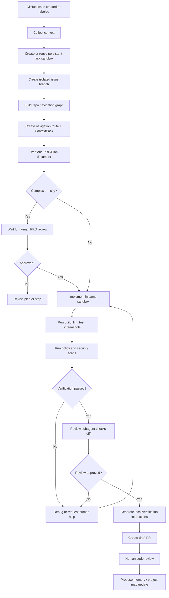

# 自动化流程蓝图

## 1. 主流程

## 2. PRD/Plan 阶段

输入：

- Issue 标题
- Issue 正文
- 标签
- 评论
- 同一 task sandbox 中的仓库结构摘要
- ContextPack、Repo Navigation Graph、CodeGraph/Knowledge Graph 摘要
- 历史相似 Issue

输出：

- `planning-document.json`
- GitHub Issue 中可见的 PRD/Plan 评论

这是一份文档，不是 PRD 和 plan 两次独立理解。它同时包含背景、目标、验收标准、风险、复杂度、预计阅读文件、预计修改文件、测试计划和验证命令。

门禁：

- 如果复杂度高，进入人工审核。
- 如果缺少关键验收标准，进入人工审核。
- 如果涉及高风险领域，进入人工审核。

## 3. 实现阶段

主 Agent 读取：

- PRD/Plan 文档
- ContextPack
- 相关文件证据链
- 技术约束
- skill 列表
- 测试命令

在实现前，Agent 必须已经完成：

- 沙箱 clone 完整仓库。
- 项目业务 skill 加载。
- codebase index。
- Repo Navigation Graph 构建。
- navigation route 生成。
- agentic search。
- ContextPack 生成。
- PRD/Plan 文档生成。

每个 Issue 必须创建独立任务分支。除非人工明确设置依赖关系，当前 Issue 不能基于其他未合并 Issue 的分支。

CodeZero implementation executor 输入：

- Issue、已批准 PRD/Plan 文档
- ContextPack、CodeGraph/Knowledge Graph 摘要、仓库 rules/skills
- 上一次质量门禁或 review feedback
- 用户在 CodeZero 中配置的模型/API key 对应环境变量

CodeZero implementation executor 输出：

- sandbox working tree 中的真实文件修改
- 可选运行日志
- 不负责 commit、push、创建 PR 或回复用户

编排层负责启动内部 coding executor、记录 `AGENT_RUN_*` / `FILE_CHANGED` / artifact、读取 `git diff`、运行质量门禁和 review agent。默认 executor 通过 `config/sandbox.yaml` 的 `sandbox.implementation_executor` 配置调用 OpenCode，但用户在 Issue、PR、dashboard 中看到的都是 CodeZero 的实现过程，不暴露底层 CLI 名称。

实现阶段不再保留 JSON action fallback。OpenCode executor 失败、退出码非零或没有产出 diff 时，编排层记录 executor artifact 并让任务进入失败/阻塞路径。

## 4. Subagent 策略

### 4.1 何时启动 subagent

- 前后端同时改动。
- 测试和实现可以并行。
- 需要独立审查。
- 需要探索代码库中不确定区域。

### 4.2 推荐并行方式

- 主 Agent：实现核心代码。
- Explorer Agent：探索现有架构和相似实现。
- Test Agent：补测试和运行失败定位。
- Frontend QA Agent：启动浏览器截图和检查 UI。
- Review Agent：最终审查 diff 和 PR 描述。

### 4.3 冲突控制

- 每个 subagent 必须声明文件所有权。
- 编排层记录写入范围。
- 同一文件不可由多个 worker 同时写入，除非主 Agent 明确合并。

## 5. 验证阶段

所有任务必须先通过通用门禁：

- build。
- lint。
- 单元测试。
- 类型检查，如果项目存在对应命令。
- policy-as-code。
- secret scan 和危险路径扫描。

### 5.1 前端任务

必须执行：

- Chrome 截图
- 控制台错误检查
- 关键路径交互 smoke test

可选执行：

- 视觉回归 diff
- 可访问性检查
- Storybook 测试

### 5.2 后端任务

必须执行：

- 相关模块测试

可选执行：

- 接口测试
- 数据库迁移 dry run
- 契约测试

## 6. PR 内容模板

PR 应包含：

- Issue 链接
- PRD 链接
- 实现摘要
- 测试结果
- 前端截图
- 风险说明
- 人工重点 Review 建议
- Agent 运行信息
- Review subagent 结论
- `pr-local-verification.json` artifact
- GitHub CLI 本地验证指令
- plain Git 本地验证指令
- base commit、agent branch、sandbox image、质量门禁命令

默认创建 draft PR。

## 7. 记忆更新阶段

PR 创建后，系统可以生成记忆更新建议：

- 历史 Issue/PR 摘要。
- 新发现的模块关系。
- 新增或修正的测试命令。
- 常见失败和修复流程。
- 项目地图更新建议。

这些建议默认作为 artifact 或 PR 附件出现，不静默写入长期记忆。Review subagent 需要检查是否过度泛化、是否包含敏感信息、是否有明确来源。

## 8. Trace 与评估

每个 workflow run 都应生成 trace：

- 状态转移。
- LLM call 摘要。
- tool call 摘要。
- Repo Navigation Graph 命中路径。
- memory hit。
- policy decision。
- quality gate result。
- Review finding。

Golden issue evals 应复用同一套 workflow 组件，评估 PRD/Plan 文档、navigation route、ContextPack、Review 和 PR body。

## 9. 人工操作

Web 看板应支持：

- 批准 PRD
- 要求修改 PRD
- 继续执行
- 暂停任务
- 取消任务
- 重试失败步骤
- 下载日志和产物
- 手动接管沙箱分支
- 审批高风险 tool call
- 查看 trace replay
- 查看 Repo Navigation Graph 路线
