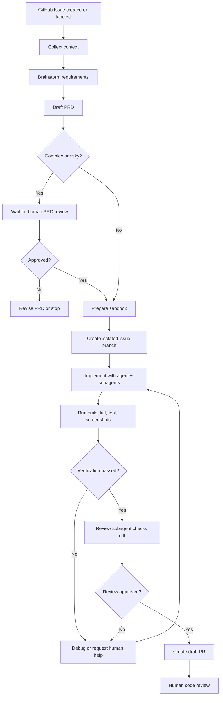

# 自动化流程蓝图

## 1. 主流程

## 2. PRD 阶段

输入：

- Issue 标题
- Issue 正文
- 标签
- 评论
- 关联文件或设计稿
- 仓库结构摘要
- 历史相似 Issue

输出：

- `prd.md`
- `brainstorm.md`
- `acceptance_criteria.md`
- `complexity.json`

门禁：

- 如果复杂度高，进入人工审核。
- 如果缺少关键验收标准，进入人工审核。
- 如果涉及高风险领域，进入人工审核。

## 3. 实现阶段

主 Agent 读取：

- PRD
- ContextPack
- 相关文件证据链
- 技术约束
- skill 列表
- 测试命令

在实现前，Agent 必须已经完成：

- 沙箱 clone 完整仓库。
- 项目业务 skill 加载。
- codebase index。
- agentic search。
- ContextPack 生成。
- 最小修改计划生成。

每个 Issue 必须创建独立任务分支。除非人工明确设置依赖关系，当前 Issue 不能基于其他未合并 Issue 的分支。

主 Agent 输出：

- 实现计划
- 代码改动
- 测试改动
- 运行日志
- 风险说明

## 4. Subagent 策略

### 4.1 何时启动 subagent

- 前后端同时改动。
- 测试和实现可以并行。
- 需要独立审查。
- 需要探索代码库中不确定区域。

### 4.2 推荐并行方式

- 主 Agent：实现核心代码。
- Explorer Agent：探索现有架构和相似实现。
- Test Agent：补测试和运行失败定位。
- Frontend QA Agent：启动浏览器截图和检查 UI。
- Review Agent：最终审查 diff 和 PR 描述。

### 4.3 冲突控制

- 每个 subagent 必须声明文件所有权。
- 编排层记录写入范围。
- 同一文件不可由多个 worker 同时写入，除非主 Agent 明确合并。

## 5. 验证阶段

所有任务必须先通过通用门禁：

- build。
- lint。
- 单元测试。
- 类型检查，如果项目存在对应命令。

### 5.1 前端任务

必须执行：

- Chrome 截图
- 控制台错误检查
- 关键路径交互 smoke test

可选执行：

- 视觉回归 diff
- 可访问性检查
- Storybook 测试

### 5.2 后端任务

必须执行：

- 相关模块测试

可选执行：

- 接口测试
- 数据库迁移 dry run
- 契约测试

## 6. PR 内容模板

PR 应包含：

- Issue 链接
- PRD 链接
- 实现摘要
- 测试结果
- 前端截图
- 风险说明
- 人工重点 Review 建议
- Agent 运行信息
- Review subagent 结论

默认创建 draft PR。

## 7. 人工操作

Web 看板应支持：

- 批准 PRD
- 要求修改 PRD
- 继续执行
- 暂停任务
- 取消任务
- 重试失败步骤
- 下载日志和产物
- 手动接管沙箱分支
