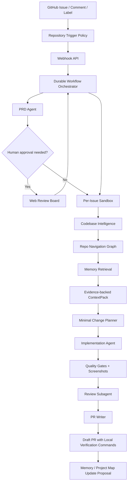

# 简历项目审核与改进路线图

审核日期：2026-05-11

## 1. 推荐定位

这个项目最适合作为一个“面向真实仓库的 GitHub Agent Bot”作品，而不是单纯的 Issue-to-PR demo。

推荐一句话定位：

> 一个可配置的 GitHub 研发 Agent：从 Issue 触发，生成可审核 PRD，在隔离沙箱中完成最小变更，通过质量门禁和 Review subagent 后创建 draft PR，并把本地验证指令直接写进 PR。

这个定位能展示的高级能力包括：

- durable workflow：长任务可暂停、可重试、可人工介入。
- multi-agent orchestration：PRD、search、implementation、verification、review、PR writer 分工。
- memory and context engineering：短期任务状态、长期项目记忆、历史 PR 经验、项目地图。
- codebase intelligence：索引、Repo Navigation Graph、agentic search、ContextPack、证据评分。
- sandboxed execution：每个 Issue 独立沙箱、独立分支、独立 PR。
- guardrails：复杂度门禁、文件范围门禁、质量门禁、Review subagent。
- developer experience：PR 中直接提供本地 clone、checkout、install、test、run 指令。
- observability and evals：trace replay、golden issue eval、cost/latency metrics、security gates。

## 2. 当前基础

仓库已经有一个很好的雏形：

- Monorepo 结构清晰：`apps/api`、`apps/worker`、`apps/web`、`packages/*`。
- 已有任务状态机：Issue 接收、PRD、沙箱、ContextPack、实现、质量门禁、Review、PR。
- 已有 GitHub webhook 路由：支持 `issues` 和 `issue_comment`。
- 已有 OpenAI-compatible provider 抽象和 JSON 输出校验。
- 已有 codebase intelligence 包：文件索引、符号索引、混合搜索、ContextPack。
- 已有 sandbox、verification、persistence、config、github 等边界模块。
- 已有平台 skill 和 system prompt。
- 已有测试覆盖核心状态机、持久化、沙箱、代码检索。

当前最主要的问题不是方向错，而是“作品集叙事”还不够聚焦：文档已经列了很多能力，但还需要把它们组织成一个可信的高级 Agent 架构，并明确下一步如何从 MVP 走向可展示的生产级形态。

## 3. 主要缺口

| 缺口                            | 为什么影响简历表现                                                                 | 建议                                                                                    |
| ------------------------------- | ---------------------------------------------------------------------------------- | --------------------------------------------------------------------------------------- |
| 记忆管理只零散出现              | 高级 Agent 项目需要解释短期记忆、长期记忆、项目知识和历史经验如何协作              | 新增独立记忆架构文档，并把 memory 接入 ContextPack、项目地图和 Review                   |
| GitHub Bot 产品形态还不够明确   | 用户希望它是一个可安装、可配置、可被 `@` 触发的机器人                              | 把触发策略提升为仓库级配置：`auto`、`mention`、`label`、`manual`、`disabled`            |
| PR 本地验证体验还没成为核心卖点 | PR 是否能被开发者快速验证，是 Agent 写代码是否可信的关键                           | PR body 强制输出 `gh pr checkout` 和 `git clone/fetch/checkout` 两套验证指令            |
| Agent runtime 文档偏抽象        | 简历项目需要讲清 tools、handoff、guardrails、tracing、structured output 的接口边界 | 补 runtime contract：模型、工具、trace、memory、guardrail、artifact 都是可插拔能力      |
| 评估体系不足                    | 展示高级水平不能只靠“能跑”，还要能证明质量稳定                                     | 增加 golden issues、prompt regression、tool-call assertions、quality gate pass rate     |
| 安全与权限模型还可以更强        | GitHub App、沙箱、密钥、网络白名单是生产级 Agent 的重点                            | 文档化最小权限、secret redaction、network allowlist、dangerous path denylist            |
| 代码导航图缺位                  | 大仓库里只靠关键词检索容易读错入口和测试                                           | 增加 Repo Navigation Graph，把入口、符号、调用链、测试、ownership、历史变更连成导航路线 |

## 4. 目标架构图



## 5. 记忆管理作为核心卖点

记忆系统应该成为本项目的高级亮点，而不是一句“长期记忆以后做”。

建议把记忆分成五类：

- Workflow memory：任务状态、事件、产物、审批记录，是可恢复执行的事实来源。
- Session memory：单次 Agent run 或多轮修复循环中的短期上下文。
- Semantic project memory：项目地图、业务术语、模块关系、路由、测试指南。
- Episodic memory：历史 Issue/PR 的执行摘要、失败原因、人工反馈和 Review 结论。
- Procedural memory：可复用的修复流程、验证流程、项目惯例和 skill 更新建议。

详细设计见 [MEMORY_ARCHITECTURE.md](MEMORY_ARCHITECTURE.md)。

关键原则：

- 代码、PRD、测试结果永远是事实来源，memory 只能作为检索线索和经验建议。
- 长期记忆不能静默改写项目规则，必须产出 `project-map-update` 或 `memory-update` artifact 供人审核。
- 所有注入模型的记忆都要带来源、时间、置信度和是否人工确认。
- 任何包含密钥、隐私、用户数据、生产日志的内容默认不得写入长期记忆。

## 6. 仓库级触发策略

当前代码已经支持：

- `issues.opened`
- `issues.labeled`
- `issues.reopened`
- `issue_comment.created` 中包含全局 `AGENT_TRIGGER_MENTION`

目标形态应该改成仓库级策略，这样同一个 Bot 可以服务不同仓库：

```yaml
repositories:
  - id: example-web
    github_owner: your-org
    github_repo: your-repo
    default_branch: main
    trigger:
      mode: mention # auto | mention | label | manual | disabled
      mention: "@agent-prd"
      auto_events:
        - issues.opened
        - issues.reopened
      label_allowlist:
        - agent-ready
      label_blocklist:
        - no-agent
        - security-review
      actor_allowlist: []
      require_repository_enabled: true
```

推荐语义：

- `auto`：匹配事件后自动入队，适合内部低风险仓库。
- `mention`：只有评论包含指定 `@bot` 才入队，适合开源仓库或高噪声仓库。
- `label`：只有打上允许标签才入队，适合团队 triage 流程。
- `manual`：只能从 Web 看板或 API 手动导入。
- `disabled`：安装 Bot 但不执行，用于灰度或暂停。

## 7. PR 本地验证体验

每个 Agent PR 都应该让开发者能在 1 分钟内知道怎么验证成果。

PR 描述建议强制包含：

````markdown
## Local Verification

### Option A: GitHub CLI

```bash
gh repo clone <owner>/<repo>
cd <repo>
gh pr checkout <pr-number>
<install-command>
<quality-gate-command>
<dev-command-if-needed>
```

### Option B: Plain Git

```bash
git clone https://github.com/<owner>/<repo>.git
cd <repo>
git fetch origin <agent-branch>
git checkout <agent-branch>
<install-command>
<quality-gate-command>
<dev-command-if-needed>
```

### Agent Verification

- Base branch: `<base-branch>`
- Base commit: `<base-sha>`
- Agent branch: `<agent-branch>`
- Sandbox image: `<sandbox-image>`
- Commands run by agent:
  - `<build>`
  - `<lint>`
  - `<typecheck>`
  - `<unit-test>`
- Screenshot artifacts: `<links>`
````

命令来源优先级：

1. `repositories.yaml` 中的 `quality_gates` 和 `frontend.dev_command`。
2. `.agent/testing-guide.md`。
3. package manager scripts。
4. Agent 推断，但必须交给 Review subagent 检查。

## 8. 推荐实施路线

### P0：把作品集叙事补齐

- 新增本文档和记忆架构文档。
- 新增高级能力矩阵和 Repo Navigation Graph 设计。
- README 改成“项目定位 + 当前能力 + 下一阶段路线”。
- ARCHITECTURE 增加 memory layer、trigger policy、PR verification handoff。
- OPERATIONS 增加仓库级触发策略和 PR 本地验证模板。

### P1：仓库级触发策略

- 已完成基础实现：`RepositoryConfig.trigger` schema。
- 已完成基础实现：webhook 按仓库查配置，不再依赖全局触发策略。
- 已完成基础实现：`auto`、`mention`、`label`、`manual`、`disabled`。
- 后续可补看板配置页和 GitHub App 安装态校验。

### P2：实现 Repo Navigation Graph

- 已完成基础实现：文件、符号、import/export、route、test、business concept、history 图。
- 已完成基础实现：每个 task 生成 `repo-navigation-graph.json` 和 `navigation-route.json`。
- 已完成基础实现：ContextPack 使用 navigation route 选文件。
- 后续增强：ownership、memory edge、Tree-sitter/SCIP adapter 和 Review subagent scope check。

### P3：实现 PR verification handoff

- 已完成基础实现：给 task 记录 base SHA、agent branch、sandbox mode/image、commands run。
- 已完成基础实现：PR body 输出 GitHub CLI 和 plain Git 两套验证指令。
- 已完成基础实现：前端截图 artifact 写入 PR。
- 已完成基础实现：生成 `pr-local-verification.json` artifact，方便后续 eval 和 Review subagent 复用。
- 后续增强：Review subagent 检查 PR body 是否包含可执行验证步骤。

### P4：实现可观测、治理和工具层

- Trace Replay / Run Debugger：已完成基础 `@agent/observability`、`GET /tasks/:id/trace` 和 Run Console trace timeline。
- MCP Tool Gateway：已完成基础 `@agent/tool-gateway` 并接入 implementation workflow，含工具注册、权限等级、策略决策、JSON action fallback、`repo.apply_patch` 和内置 repo/shell 工具。
- Policy-as-Code Guardrails：已完成 Tool Gateway 内的 path/command/tool/permission 基础策略判断。
- Tool Permission UI。
- Security Scanning Pipeline。
- Cost / Latency / Model Router。

### P5：实现记忆闭环

- 已完成基础实现：新增 `@agent/memory`，含 `FileMemoryStore`、approved-only 检索和相似 Issue 排序。
- 已完成基础实现：每次成功创建 PR 后生成 `memory-proposal.json`。
- 已完成基础实现：从 task run 提取 episodic/procedural memory proposal。
- 已完成基础实现：通过 Memory API 和 Run Console Memory Inbox 列表、approve/reject 人审 proposed memory。
- 已完成基础实现：ContextPack 生成时检索 approved memory，并标注来源、分数和命中理由。

### P6：补评估体系和仓库 onboarding

- 已完成基础实现：建立 `evals/golden-issues`、`evals/candidates`、`@agent/evals` 和 `pnpm eval:golden`。
- 已完成基础实现：对 ContextPack、导航路线、memory、PR body、trace 做 regression test。
- 已完成基础实现：GitHub Actions 中运行 `pnpm check` 和 `pnpm eval:golden`，并上传 eval report artifact。
- 后续增强：对 PRD、最小修改计划、Review 结论做 regression test。
- 已完成基础实现：Repository Onboarding Agent 和 CLI，自动生成 `.agent/*` 项目知识和配置建议。
- 记录 token、耗时、质量门禁通过率、人工修改率。
- 已完成基础实现：看板展示 Agent 决策链和 memory 审核入口。

完整能力清单见 [ADVANCED_AGENT_CAPABILITIES.md](ADVANCED_AGENT_CAPABILITIES.md)，代码导航图设计见 [REPO_NAVIGATION_GRAPH.md](../REPO_NAVIGATION_GRAPH.md)。

## 9. 简历展示建议

README 第一屏应该让招聘方马上看到：

- 这是 GitHub Bot，不只是脚本。
- 它不是“prompt 生成代码”，而是 workflow + runtime + sandbox + memory + verification。
- 它尊重工程边界：最小修改、独立分支、质量门禁、人工审批。
- 它照顾开发者体验：PR 里有本地验证命令、截图、测试摘要和风险说明。

面试时可以按这条线讲：

1. 为什么不能让 Agent 直接从 Issue 写代码。
2. 如何用 PRD 和复杂度门禁降低误做风险。
3. 如何用 codebase intelligence 和 ContextPack 控制上下文。
4. 如何设计 memory，让系统越用越懂项目但不污染事实来源。
5. 如何用沙箱、质量门禁和 Review subagent 控制代码风险。
6. 如何把 Agent 输出变成开发者能快速验证的 PR。

## 10. 外部设计参考

这些参考不是依赖项，而是用于对齐当前主流 Agent 架构语言：

- [OpenAI Agents SDK](https://developers.openai.com/api/docs/guides/agents)：tools、handoff、state、approval、tracing 等 runtime 概念。
- [OpenAI Agents SDK Sessions](https://openai.github.io/openai-agents-js/guides/sessions/)：session memory、custom storage、history compaction。
- [OpenAI Sandbox Agent Memory](https://openai.github.io/openai-agents-js/guides/sandbox-agents/memory/)：运行记忆、summary、memory layout、staleness 处理。
- [LangGraph Durable Execution](https://docs.langchain.com/oss/python/langgraph/durable-execution)：长任务、人审、恢复执行。
- [LangGraph Memory](https://docs.langchain.com/oss/python/langgraph/add-memory)：短期线程记忆和长期应用记忆。
- [GitHub Webhook Events](https://docs.github.com/en/enterprise-cloud@latest/webhooks/webhook-events-and-payloads)：`issues`、`issue_comment`、`pull_request` 等事件权限模型。
